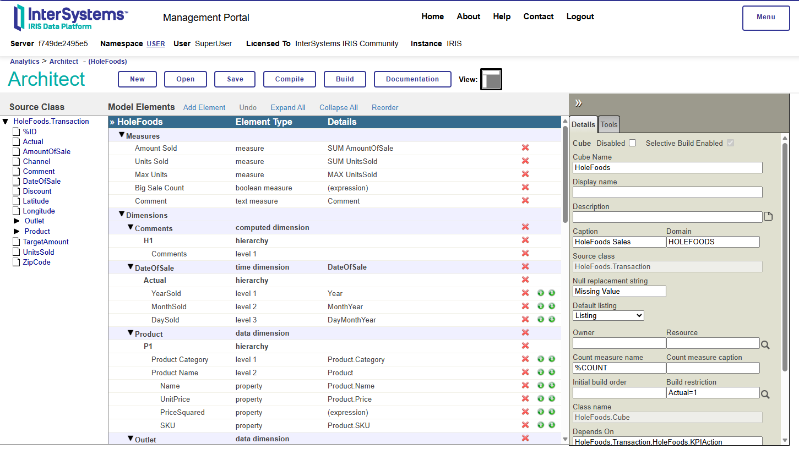
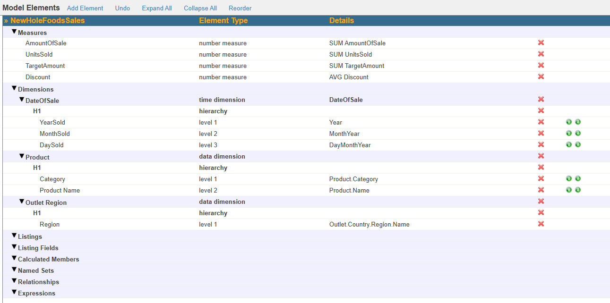
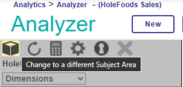
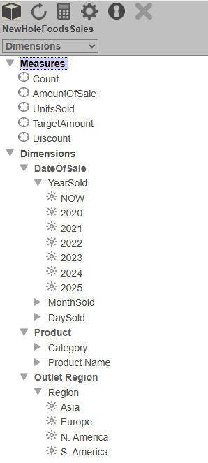
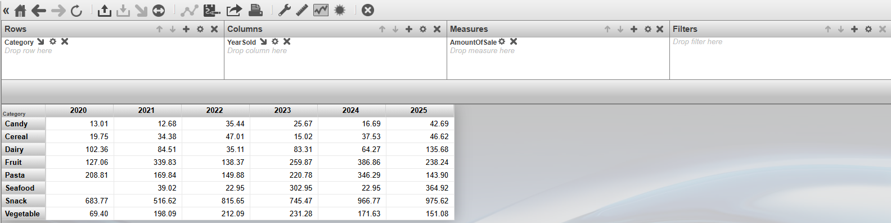
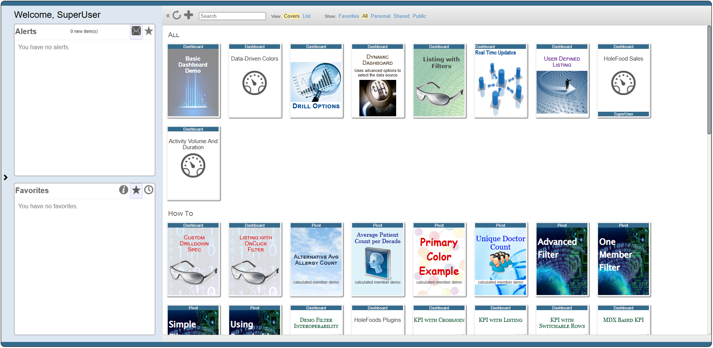
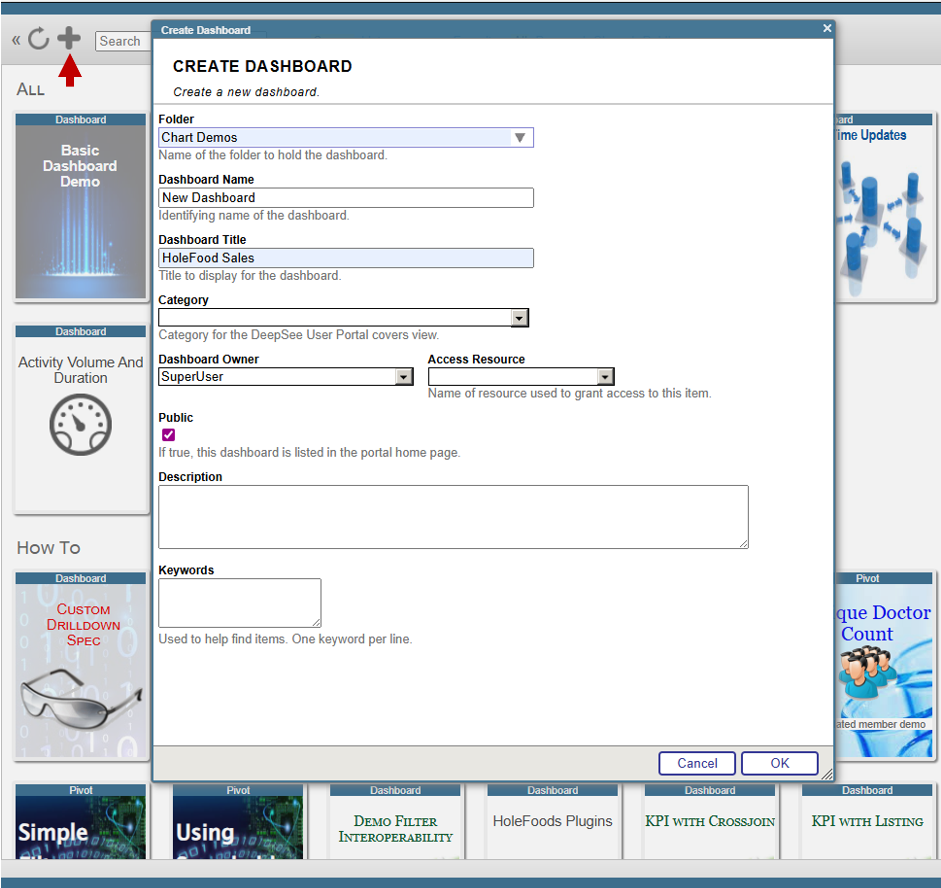
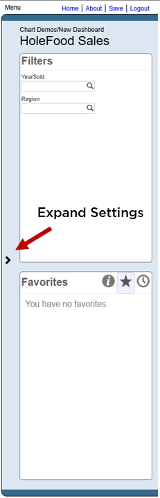
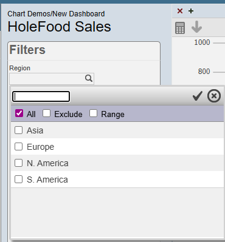
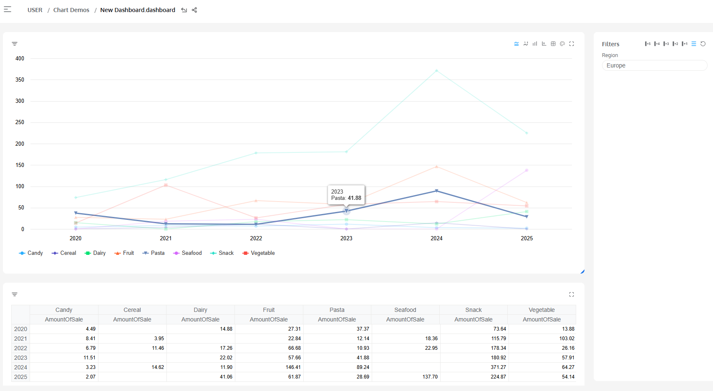

# InterSystems IRIS BI Quickstart

InterSystems IRIS BI is an embedded Business Intelligence tool. As it is embedded in InterSystems IRIS, the tool is run alongside the data meaning it can run on near real-time data and run within other applications.

## Set-up

### 1. Run InterSystems IRIS
 
To get started using analytics, start an instance of InterSystems IRIS. This can be done with Docker (see [Get IRIS Community With Docker](../GettingStartedWithIRISCommunity/RunningWithDocker.md)), or you can use any other running IRIS instance.

```sh
docker run --name iris-analytics --publish 1972:1972 --publish 52773:52773 -d intersystemsdc/iris-community:latest-em
```

Its recommended to use the Docker image at `intersystemsdc` because this has the InterSystems Package Manager pre-installed, but [IPM can also be installed separately](https://github.com/intersystems/ipm). IPM will be used to install the samples data below.

Log into the management portal at http://localhost:52773/csp/sys/%25CSP.Portal.Home.zen with the credentials:

- Username: SuperUser
- Password: SYS

### 2. Activate Namespace

Analytics is not enabled by default. To enable it for a given namespace:

1. Navigate to **System Administration** -> **Security** -> **Applications** -> **Web Applications** -> **Go**. This page lists all the Web Applications on your instance of InterSystems IRIS.

2. Locate the CSP Application for the namespace in which you want to use Analytics, this has the name `/csp/<namespace>`, so for the USER namespace this is `/csp/user`. Select this application name to open the options.

3. Click the Checkbox for **Analytics** under **Enable** and **CSP/ZEN**.

4. Click **Save** at the top of the page to save changes

### 3. Download Sample Data

This tutorial will use sample BI data including cubes, pivot tables and dashboards. This data is available on [GitHub](https://github.com/intersystems/Samples-BI/) as well via the InterSystems Package Manager.

To Install Samples-BI with IPM, ensure you have IPM installed (it will be installed already if you used the command above, otherwise installation instructions are [available on the IPM GitHub](https://github.com/intersystems/ipm)). 

Open an IRIS terminal:

```sh
docker exec -it iris-analytics iris session iris
```

and run:

```objectscript
zpm "install samples-bi" 
```

Alternatively, the [Sample-BI repository](https://github.com/intersystems/Samples-BI/) is a docker-compose template, so can be used as it's own InterSystems IRIS docker container. To do this, simply run:

```sh
git clone https://github.com/intersystems/Samples-BI.git 
cd Samples-BI
docker-compose build 
docker-compose up -d
```

## InterSystems IRIS BI Workflow

The aim of Business intelligence and analytics is to convert raw data into actionable or usable insights. This can be broken down into three steps:

### 1. Create Data Models in Architect Portal

Raw data alone is not sufficient for analytics; some processing is necessary. Processing could include adding aggregate measures like the sum, count or average of a column. Data may also be organised into hierarchical or temporal categories.

Data organisation is done with [OLAP Cubes](https://en.wikipedia.org/wiki/OLAP_cube). Cubes are multi-dimensional data structures that organize data into measures (values like the sum, average or count), and dimensions (like time, category or region). They enable users to slice, filter, drill down and aggregate large datasets.  

### 2. Create Pivot Tables in the Analyzer Portal

Pivot tables are a way of organising the multi-dimensional cube data into two dimensional tables containing the required data for a specific view or purpose.

### 3. Create Dashboards in the User Portal

Dashboards are used to view and publish data into an easily readable format, allowing users to rapidly see insights generated from the data.

## Guide

### 1. Architect

To open the Architect portal, open the Management Portal and navigate to Analytics -> Architect -> Go.

You can create, open, save and compile cubes using the buttons at the top of the page.



The properties within the Source Class are displayed in the left hand panel, while the cube properties are shown in the center. To create a new cube property, drag a property from the Source Class to the required dropdown value in the list. Once added to the list, you may need to change the desired settings, this is done in the right hand side column.

As an example, we may wish to know the average UnitsSold per transaction. To do this, we can drag and drop UnitsSold to "Measures" in the center of the page. This will by default set the measure to SUM of UnitsSold. Ensuring this measure is selected, turn your attention to the right-hand 'Details' Panel, and choose `AVG` from the Aggregate Dropdown.

There are many more settings and configurations to explore, these can be found in [BI Modeling | Documentation](https://docs.intersystems.com/irislatest/csp/docbook/DocBook.UI.Page.cls?KEY=D2MODEL_ch_cube), or in the [BI Tutorial | Documentation](https://docs.intersystems.com/irislatest/csp/docbook/DocBook.UI.Page.cls?KEY=D2DT_ch_setup).

#### Create A Simple Cube

1. Create a New Cube:

    Click New at the top of the page and fill out the wizard with the following:

    - Definition Type: Cube
    - Cube Name: NewHoleFoodsSales - this will automatically fill out the display name and class name.
    - Cube Source: Class
    - Source Class: HoleFoods.Transaction (hit browse to find this in a UI)

    Then Click Ok

2. Add Measures

    We want to add the AmountOfSale, TargetAmount and UnitsSold as potential measures we want to track. We are also interested in the average discount given.

    - Drag `AmountOfSale`, `TargetAmount` and `UnitsSold` properties from the Source Class panel on the left hand side to the "Measures" list. Under "Details" you will see that it defaults to aggregating by the SUM of these values.
    - Drag `Discount` to the Measures list. Here we are more interested in the average discount, so in the Details panel to the right, change the Aggregate value to AVG. 

3. Add Dimensions

    Our cube will have 3 dimensions, Date (year, month and Day), Product (name, category) and Region.

    - Drag `DateOfSale` to the dimensions list, this will create a new time dimension and hierarchy. 

    - Click on the new `DateOfSale` dimension, and find the "Extract Value with Function" setting. Change this to `Year`, and change the Name value to "YearSold".

    - Repeat the dragging DateOfSale to the same dimension, change the Value function to `MonthYear`, and name to "MonthSold". Repeat again for DaySold. 
    
    - Drag `Product` from the source class to the Dimensions List. Then drag `Product.Category` and `Product.Name` to the Product dimension.
    
    - Drag `Outlet > Country > Region > Name` to form a new dimension. Change this dimension name to "Outlet Region".

4. Check, compile and build

    At this point, your new cube should look something like this:


    - Hit Compile to ensure the cube definition is saved and compiled.
    - Hit Build to create the cube from the definition created.

5. View sample cube

    The cube built here is a simplified version of a prebuilt sample cube. To view a more complicated version, hit open and select "HoleFoods Sales", and explore some of the advanced features included here.

    Moving Forward to the next step, choose whether to use the version you created, or the complete sample version.

### 2. Analyzer

To open the Analyzer, return the Management Portal and navigate to `Analytics -> Analyzer -> Go`. 

You can also go directly from the Architect by selecting the `Tools` tab on the right-hand panel, and clicking the Analyzer Button.

To open a cube, hit the cube icon at the top of the left hand panel.



The cube properties (dimensions, measures and others) will then be shown in the left hand panel.



To create a pivot table by dragging and dropping dimensions into the rows and columns boxes in the centre of the page. Add measures to the measures box to define what value you want to examine.

#### Create A Pivot Table

1. Open the "NewHoleFoodsSales" Cube from the previous step (or the old sample version equivalent)
2. Locate `Product` -> `Product Category` in the list of dimensions. Drag this to the `Columns` box in the centre of the page.
3. Locate `DateOfSale` -> `YearSold` and drag this into the `Rows` box.
4. Locate `AmountOfSale` in the list of Measures and drag this to the `Measures` box in the centre of the page.

    - You should now see a table of revenue by product category and year.
    

5. Hit the `Save As` button and choose the folder and pivot name. To create a new folder type a folder name into the Folder box.

Pivot tables  can be used in a dashboard in the User Portal, or exported to Excel, CSV or PDF from the icons in the centre of the page.

### 3. User Portal

We can view and publish pivot tables from the User Portal.

To open the User Portal, return to the Management Portal Homepage and then Navigate to `Analytics -> User Portal -> Go.`

Samples-BI includes many example dashboards which you can browse for inspiration.



To create a new dashboard, click the `+` icon and select Add Dashboard.



The dashboard settings are found by clicking the arrow on the left-hand side of the screen to bring out the settings panel.



The contents of the dashboard is handled with "Widgets", these include charts, measures and tables.

#### Create a Dashboard

1. Create a new dashboard
2. Add a chart widget
    - Expand settings panel, select widgets and click the `+` icon to open the Widget Wizard.
    - Select a chart type (e.g. Line graph) and a saved pivot table data source (e.g. the pivot created in the previous step)
3. Edit Widget settings
    - Expand settings, select "Widgets" -> "Widget 1" -> Turn on "CSV Export". - You will see a new button appear above the chart which allows you to export the data as a CSV.
    - Explore the other settings available
4. Add a control
    - Expand settings, select "Widgets" -> "Widget 1" -> Controls -> `+`
    - Select:
        - Location: Dashboard
        - Target: * (affects all widgets with same data source)
        - Action: "Apply Filter"
        - Filter category: Region
    - Click ok.
    - A new filter should appear in the 'Filters' panel, allowing you to filter all the data on the dashboard by the selected category:

    

5. Explore other settings and controls in the menu.

6. Hit "Save" to ensure your changes are saved and published (if your dashboard is public)

## DeepSeeWeb

There is a community-supported user interface for the dashboards, which provides a modern lightweight UI for use instead of the User Portal

To use DeepSeeWeb, run:

```objectscript
zpm "install mdx2json"
zpm "install dsw"
```

Then open, http://localhost:52773/dsw/index.html and enter the credentials to log in



This implementation has a dependency on the JavaScript Library Highcharts which is only free for non-commercial use and may require a paid license for production settings.

## Conclusions

This guide has shown how to get started using InterSystems IRIS BI to go from raw data, to insightful tables and organised dashboards. As a short quickstart, there is plenty more to discover within the [Documentation](https://docs.intersystems.com/irislatest/csp/docbook/DocBook.UI.Page.cls?KEY=D2GS_ch_intro), the [Developer Community](https://community.intersystems.com/), the [InterSystems Developers Youtube Channel](https://www.youtube.com/c/InterSystemsDevelopers) or through [Learning Services content](https://learning.intersystems.com/totara/coursecatalog/courses.php).