This page is a brief reference guide to getting started using the recommended ObjectScript development environment, VS Code. The guide is not comprehensive, but should have enough information to get started. For comprehensive information, see "Further Resources".

VS Code is the recommended development platform for IRIS and ObjectScript code.  VS Code is widely used, available on Windows, Mac and Linux, and can be downloaded from the [VS Code website](https://code.visualstudio.com/download). 

There are three officially supported VS Code extensions to improve the development experience: 
- InterSystems Language Server
- InterSystems Server Manager
- InterSystems ObjectScript Extension

These can be downloaded together as the [InterSystems ObjectScript Extension Pack](https://marketplace.visualstudio.com/items?itemName=intersystems-community.objectscript-pack). After installing, the InterSystems logo should appear on the navigation panel on the left hand side:

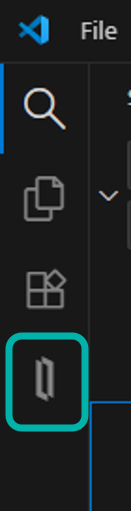

(The button layout will depend on the other extensions installed)
Click the logo to open the InterSystems Server Manager.  

### Configuring Server Connection

To create a new server connection, make sure your IRIS instance is running, then press the add server button. Be aware, this button only appears when you hover over the panel with your mouse. 

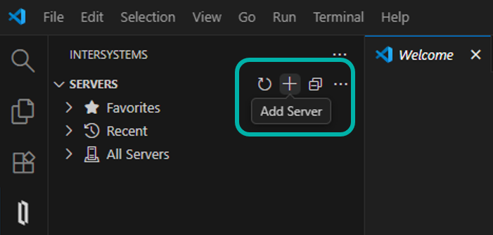

You will then be prompted for the details of your server: 
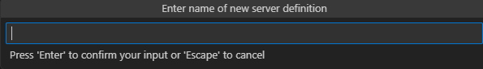
It will ask you the following: 

- **Name** : Give your server a memorable name.
- **Description**: Optional description of your server.
- **Hostname or IP Address** : Server location, this is `localhost` if you are running locally. 
- **Port**: The web-server port number (52773 is default for IRIS)
- **Path Prefix**: (Optional) If a web-server hosts multiple InterSystems servers, the URL for the server may have an additional Path prefix. As an example, for a server URL of https://samplehost.com:8080/irisprod/ the path prefix would be "/irisprod". 
- **Username**: (Optional) Username on server. If it is not provided, you will be prompted each time you connect.
- **Connection Type**: HTTP/HTTPS (localhost is HTTP)

This will create a `settings.json` file with the connection details: 
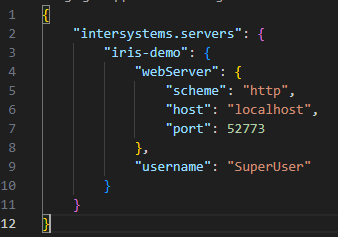
You can access this by right clicking on the server definition and choosing edit settings.

After adding these settings, you can try to connect by clicking the refresh icon, or right clicking on the server definition and choosing refresh. You will be prompted for the password (you may also be prompted for your username). You can save the password by clicking the key icon at the top-right of the entry box. 

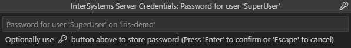

### Opening Terminal, Management Portal and Explorer

Once connected, you can unpack the connection to see the namespaces available.

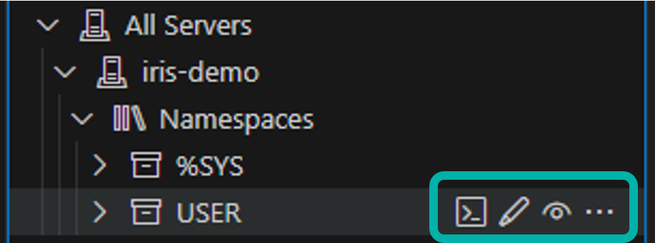

 From here, you can use the icons to the right of each namespace to: 
 - **Open a IRIS terminal in VS Code**
 - **View or edit code**. These open the namespace connection to your current workspace (either as Read-only or editable)
 - **Open the Management Portal** (Option appears on clicking the three dots)

### Working with files

There are several ways to work with your files on the server, you can click the `Edit code` button shown above to edit code directly on the server, or you can export code to work locally. To export code, use the `Explorer` panel in the InterSystems Server Manager page: 

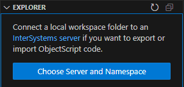

Click Choose Server and Namespace, and you will be prompted to choose server, and the namespace to connect to. You may also be prompted for credentials. 

You will then see the classes, routines and other files on the server: 

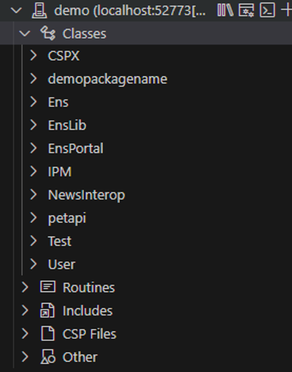

Right click on any file to bring up the following options: Compile, Delete and Export. Choose Export to start working on the package locally.

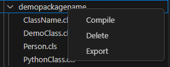

This will then copy the files to your open workspace in a folder called src: 

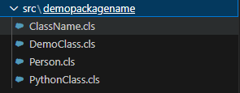

From here, you can open the file, make changes and save the file. By default, saving the file locally will compile the file and import it back to the server. You can turn off this default behaviour by finding `ObjectScript: Compile on Save` in the VS Code Settings. 

To manually Import and Compile the file, right click on the file in the Workspace and click `Import and Compile`: 
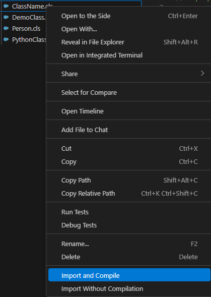

### Helpful features

- **Autocomplete**
	The InterSystems VS code ObjectScript pack includes many helpful autocomplete features, like creating a class definition for a new `<class>.cls` file created in a package directory, and providing boilerplate component definitions. 
- **Error Detection***
	Any syntax errors in your code will be detected and detailed in the `Problems` pane at the bottom of the page.
	![[vs-code-error-detection.png]]
- **Compilation output**
	You can see the output of any compilation attempts in the `Output` pane. 
	![[vs-code-compilation-output.png]]
- **ObjectScript REST Debugger** - There is a built-in debugger for REST APIs making the challenge of seeing the process behind requests much simpler. 

### Recommended Third Party Extensions

- Source control and **Git** - VS Codes built in support of git makes managing source control easy.
- **Container tools** and **Docker** extensions 
- **SQLTools for IRIS** - Lightweight SQL connection for quick queries. Community supported but not officially supported. 
-  **Jupyter** and **Jupyter Server Proxy for InterSystems IRIS** for jupyter notebook support in VS code.
- **REST Client** - allows sending of HTTP Requests from VS Code 

### Further Resources

- [Using VS Code with ObjectScript | InterSystems Documentation](https://docs.intersystems.com/components/csp/docbook/DocBook.UI.Page.cls?KEY=GVSCO_intro)
- [Video: Install and Use ObjectScript Extensions for VS Code](https://learning.intersystems.com/course/view.php?id=1458)
- [Course: Developing on an InterSystems Server Using VS Code](https://learning.intersystems.com/course/view.php?id=1678)
- [VS Code Related Resources | InterSystems Developer Community ](https://community.intersystems.com/post/vs-code-related-resources)
