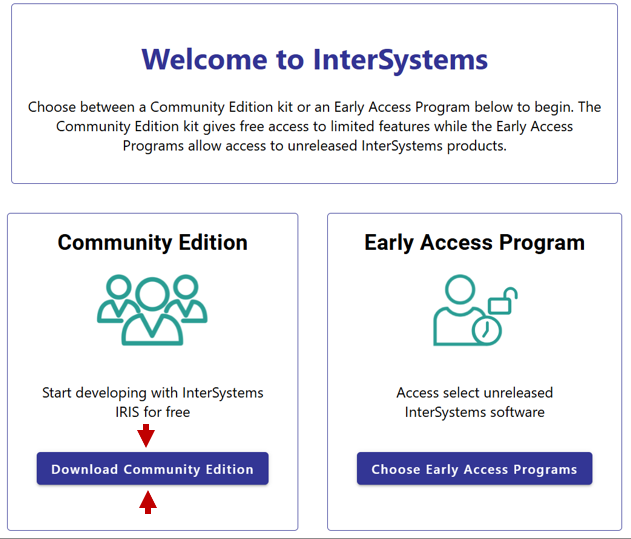
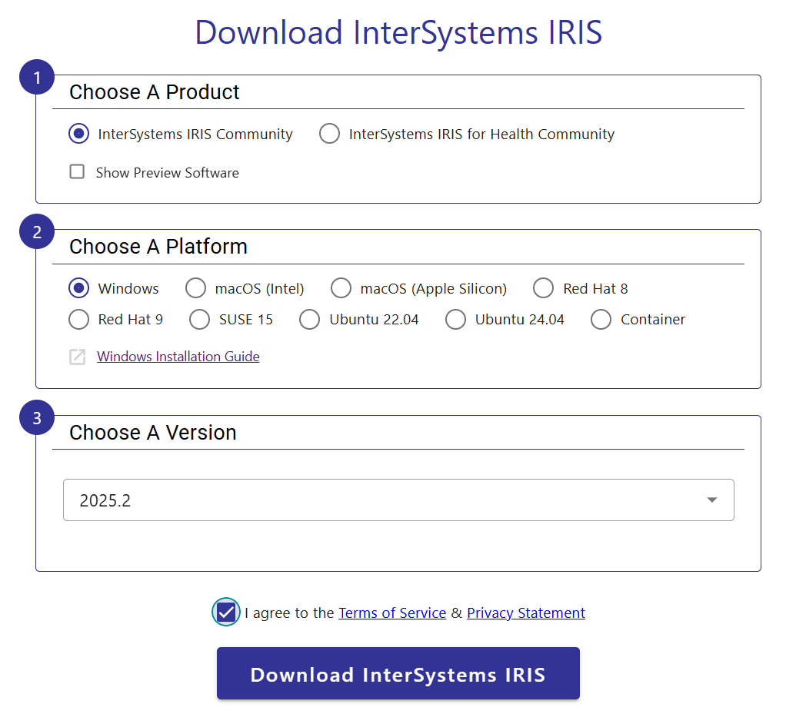

# Getting Started with IRIS Community

InterSystems IRIS is an advanced data platform, providing SQL and NoSQL database management, server-side application coding and data-analytics in one, trusted, enterprise-grade product. InterSystems IRIS for Health uses InterSystems IRIS at the core, but includes additional healthcare features, including tools for a FHIR server, and built in handling of many healthcare data standards. 

InterSystems IRIS Community and InterSystems IRIS-Health Community are free-to-use versions for experimentation, evaluation and non-commercial explorations of the platform's capabilities. There are certain resource and functionality limitations to prevent these editions being used in a production environment, for example the total data limit is 10 GB and the license key expires 1 year after the version's release. However, these are a great resource to begin exploring how to use InterSystems IRIS.

While this article will focus on using InterSystems IRIS Community Edition, the same is true for InterSystems IRIS for Health Community Edition.

InterSystems IRIS Community can be used in three ways: 
- Run in a container using Docker
- Download an install kit
- Run on the cloud

## Running with Docker

The easiest way to get started using InterSystems IRIS Community Edition is to use Docker. Docker is a containerization framework that runs software in a standardized environment. In this way, the install process is the same for all operating systems. 

### 1. Install Docker

Docker can be downloaded from their [website](https://docs.docker.com/get-started/get-docker/). 

### 2. Download and Run the InterSystems IRIS Community Edition

The process of downloading and running the InterSystems IRIS Community Edition can be performed by a single command: 

```bash
docker run --name my-iris --publish 52773:52773 --publish 1972:1972 -d intersystems/iris-community:latest-em
```
To break this down: 
- `run` is the docker command to run an image. It will search for the container locally, before then searching online with the `docker pull` command. Therefore, the `pull` command does not need to be run separately.
- `intersystem/iris-community:latest-em` is the main parameter of the run command. This is the location of the InterSystems IRIS Community Edition within the docker hub, which is the market place for container images. 
    - `latest-em` is a tag for the version being downloaded, `em` stands for extended maintenance. You can also specify a version number, e.g. `2025.1` or `latest-cd` for the latest version in continuous development.
- `--name my-iris` gives your container the name my-iris, you can change this to anything you want, but it's useful to make it something memorable.
- `publish` maps your local ports to the container ports (local:container). InterSystems IRIS sends binary data on Port 1972 and uses Port 52773 for web-server data.  If you have something running locally on ports 52773 or 1972, you can map the container ports to different ports. 
- `-d` flag detaches your terminal so you can continue to use it. 

You can start using InterSystems IRIS through the management portal at http://localhost:52773/csp/sys/%25CSP.Portal.Home.zen 

The default username is `_SYSTEM` and password is `SYS`; you will be prompted to change this password after logging in.

You can then start an IRIS terminal with: 

```bash
docker exec -it my-iris iris session iris
```
or a bash terminal with: 
```bash
docker exec -it my-iris bash
```

#### InterSystems IRIS for Health Community Edition

To download the health-care specific version of our core product, InterSystems IRIS for Health Community edition, the above command changes to: 

```bash
docker run --name my-iris --publish 52773:52773 --publish 1972:1972 -d intersystems/iris-health-community:latest-em
```
The usage is identical to what is covered above, but this edition contains healthcare specific libraries, including the ability to [set up a FHIR server](../FHIRServer/CreateAFHIRSeverIn5Minutes.md)

And there you have it, a fully functional local version of InterSystems IRIS Community Edition to start exploring. To set-up your development environment see [Setting Up your development environment](../DevelopmentEnvironment/Development%20Environment%20Set-up.md).

### Unexpire passwords

By default, Community editions of IRIS health have the password SYS for every account, but these have expired, meaning you will be prompted to change the passwords on first login with the management portal. Authorization with other methods might fail due to an unexpired password. You can unexpire the passwords with the following command

```
set $NAMESPACE = "%SYS"
do ##class(Security.Users).UnExpireUserPasswords("*")
```

**This is only suitable for development and should not be used in production.**

## Downloading an Install Kit

You can directly download InterSystems IRIS Community and InterSystems IRIS for Health Community from https://evaluation.intersystems.com/Eval/. You will need to sign in with an InterSystems single-sign-on window, if you do not already have an account you can create one for free.



Once signed in, on the page you will see a link to the Community Edition. Click the Community Edition link to see the download options: 



From here, choose whether you would like InterSystems IRIS Community or InterSystems IRIS For Health Community, then choose your operating system and the version (remember that license files will expire 1 year after release, so its recommended to choose the most recent).

Finally, accept Terms of Service and Privacy Statement, and then select Download to begin downloading the installation kit. 

For more information on the install, see the [platform specific installation guides in the documentation](https://docs.intersystems.com/irislatest/csp/docbook/DocBook.UI.Page.cls?KEY=PAGE_deployment_install)


## Running On the Cloud

Deploy InterSystems IRIS Community Edition on the cloud for free with AWS or Azure. The marketplace links for these are: 
- Amazon Web Services (AWS)
    - [InterSystems IRIS Community](https://aws.amazon.com/marketplace/pp/prodview-tdzm2pjb7opqs?utm_source=DC)
    - [InterSystem IRIS For Health Community](https://aws.amazon.com/marketplace/pp/prodview-on23erdgh5evc?sr=0-4&ref_=beagle&applicationId=AWSMPContessa)
- Microsoft Azure
    - [InterSystems IRIS Community](https://marketplace.microsoft.com/en-us/product/virtual-machines/intersystems.intersystems-iris-community?tab=Overview)
    - [InterSystem IRIS For Health Community](https://marketplace.microsoft.com/en-us/product/virtual-machines/intersystems.intersystems-iris-health-community?tab=Overview)

A complete walkthrough is shown for AWS below.

### AWS 

To get started with AWS, create an account. You can sign up for a [Free Tier Account](https://aws.amazon.com/free/) which provides $100 free credits to evaluate, and automatically shuts off to prevent charges. Through this you can get started running InterSystems IRIS Community Edition on the cloud completely free.

Note the instructions below are the same for InterSystems IRIS Community Edition and InterSystems IRIS for Health Community Edition (link above).

Once signed in on AWS go to [InterSystems IRIS Community Edition on the AWS Marketplace](https://aws.amazon.com/marketplace/pp/prodview-tdzm2pjb7opqs?utm_source=DC)


Click `View Purchase Options` to see the "Subscribe to InterSystems IRIS Community Edition page". This page includes Terms and Conditions, along with pricing details, which shows the Total amount as $0.00.

Scroll to the bottom of the page and click `Subscribe`:


It might take a minute to process the Subscription, but then you should see the following: 


From here you can select your launch configuration and settings:


If you are not familiar with launching on AWS, it's recommended to use the `EC2 Launch Console`. 

#### E2 launch console

When using the Launch Console, if you have clicked through the InterSystems IRIS Community Edition marketplace page, you should have the correct Amazon Machine Image (AMI) already selected. Otherwise, you can select it from the catalog. 

You then need to select your instance type, this is the machine that InterSystems IRIS Community Edition will be running on. If you are a member of the free tier, you will be limited to small machines here. 

Then, create a Key Pair, this allows secure SSH logins, this will download a Private Key which you can use to login. 

Create a Security Group with suitable configurations and Configure storage, then click 

You instance will take a bit of time to launch and do appropriate status tests, but after that will be available online. 


From the Instance Dashboard you can find the Public DNS, which is the address used to connect to the instance with SSH or as a web-server.

#### Connecting to session
You can connect using SSH, using the Private key downloaded earlier and either the IP or DNS addresses listed under the instance summary. The default username to connect is "ubuntu"

```bash
# Run to ensure key is not publically viewable
chmod 400 "my-key.pem"
# Connect to instance using DNS
ssh -i "my-key.pem" ubuntu@ec2-??-??-??-???.compute-1.amazonaws.com
```
After connecting with SSH, you should see a note about InterSystems IRIS Community Edition. You will need to reset your password: 

```bash
iris password
```
Then you can start an IRIS terminal with: 
```
iris session iris
```
```
Node: 28e8204d3519, Instance: IRIS

USER>write "Hello World!"
Hello World!
```

You may be able view the management portal using the DNS location listed, though this will depend on the security settings selected.

`http://ec2-??-??-??-???.compute-1.amazonaws.com:52773/csp/sys/%25CSP.Portal.Home.zen`

Where `?` values replace is the server IP address.

#### Terminating Instance

When you are finished working with your InterSystems IRIS Community Edition instance, consider terminating it to avoid excess charges (or wasting free credits).


You now have a fully functional InterSystems IRIS instance running in the cloud—completely free and ready for exploration.

