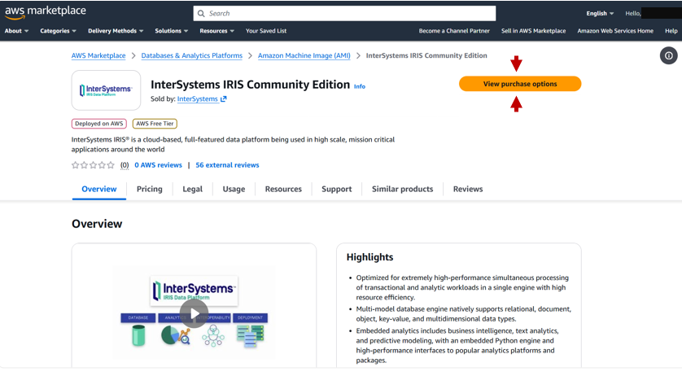
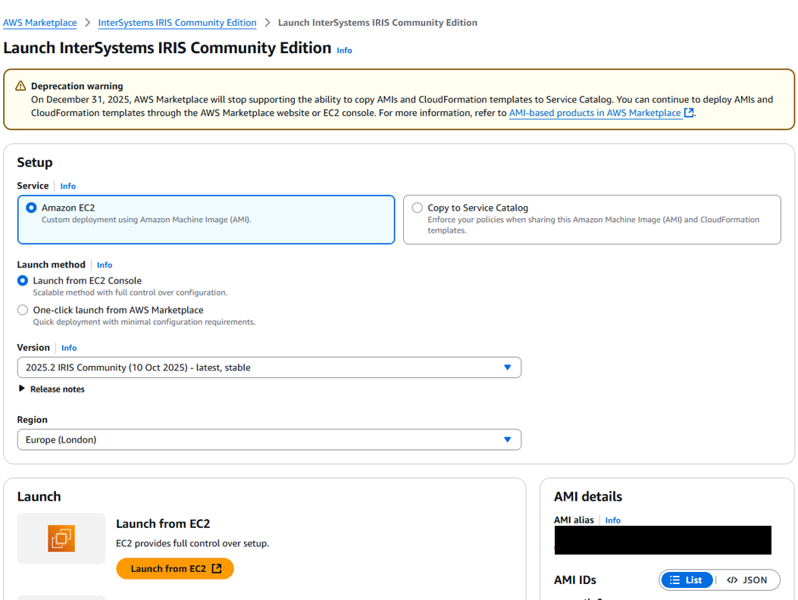

## Running On the Cloud

Deploy InterSystems IRIS Community Edition on the cloud for free with AWS or Azure. The marketplace links for these are: 
- Amazon Web Services (AWS)
    - [InterSystems IRIS Community](https://aws.amazon.com/marketplace/pp/prodview-tdzm2pjb7opqs?utm_source=DC)
    - [InterSystem IRIS For Health Community](https://aws.amazon.com/marketplace/pp/prodview-on23erdgh5evc?sr=0-4&ref_=beagle&applicationId=AWSMPContessa)
- Microsoft Azure
    - [InterSystems IRIS Community](https://marketplace.microsoft.com/en-us/product/virtual-machines/intersystems.intersystems-iris-community?tab=Overview)
    - [InterSystem IRIS For Health Community](https://marketplace.microsoft.com/en-us/product/virtual-machines/intersystems.intersystems-iris-health-community?tab=Overview)

A complete walkthrough is shown for AWS below.

### AWS 

To get started with AWS, create an account. You can sign up for a [Free Tier Account](https://aws.amazon.com/free/) which provides $100 free credits to evaluate, and automatically shuts off to prevent charges. Through this you can get started running InterSystems IRIS Community Edition on the cloud completely free.

Note the instructions below are the same for InterSystems IRIS Community Edition and InterSystems IRIS for Health Community Edition (link above).

Once signed in on AWS go to [InterSystems IRIS Community Edition on the AWS Marketplace](https://aws.amazon.com/marketplace/pp/prodview-tdzm2pjb7opqs?utm_source=DC)



Click `View Purchase Options` to see the "Subscribe to InterSystems IRIS Community Edition page". This page includes Terms and Conditions, along with pricing details, which shows the Total amount as $0.00.

Scroll to the bottom of the page and click `Subscribe`:


It might take a minute to process the Subscription, but then you should see the following: 


From here you can select your launch configuration and settings:



If you are not familiar with launching on AWS, it's recommended to use the `EC2 Launch Console`. 

#### E2 launch console

When using the Launch Console, if you have clicked through the InterSystems IRIS Community Edition marketplace page, you should have the correct Amazon Machine Image (AMI) already selected. Otherwise, you can select it from the catalog. 

You then need to select your instance type, this is the machine that InterSystems IRIS Community Edition will be running on. If you are a member of the free tier, you will be limited to small machines here. 

Then, create a Key Pair, this allows secure SSH logins, this will download a Private Key which you can use to login. 

Create a Security Group with suitable configurations and Configure storage, then click 

You instance will take a bit of time to launch and do appropriate status tests, but after that will be available online. 


From the Instance Dashboard you can find the Public DNS, which is the address used to connect to the instance with SSH or as a web-server.

#### Connecting to session
You can connect using SSH, using the Private key downloaded earlier and either the IP or DNS addresses listed under the instance summary. The default username to connect is "ubuntu"

```bash
# Run to ensure key is not publically viewable
chmod 400 "my-key.pem"
# Connect to instance using DNS
ssh -i "my-key.pem" ubuntu@ec2-??-??-??-???.compute-1.amazonaws.com
```
After connecting with SSH, you should see a note about InterSystems IRIS Community Edition. You will need to reset your password: 

```bash
iris password
```
Then you can start an IRIS terminal with: 
```
iris session iris
```
```
Node: 28e8204d3519, Instance: IRIS

USER>write "Hello World!"
Hello World!
```

You may be able view the management portal using the DNS location listed, though this will depend on the security settings selected.

`http://ec2-??-??-??-???.compute-1.amazonaws.com:52773/csp/sys/%25CSP.Portal.Home.zen`

Where `?` values replace is the server IP address.

#### Terminating Instance

When you are finished working with your InterSystems IRIS Community Edition instance, consider terminating it to avoid excess charges (or wasting free credits).


You now have a fully functional InterSystems IRIS instance running in the cloud—completely free and ready for exploration.

