# Running On the Cloud

Deploy InterSystems IRIS Community Edition on the cloud for free with AWS or Azure. The marketplace links for these are: 

- Amazon Web Services (AWS)
    - [InterSystems IRIS Community](https://aws.amazon.com/marketplace/pp/prodview-tdzm2pjb7opqs?utm_source=DC)
    - [InterSystem IRIS For Health Community](https://aws.amazon.com/marketplace/pp/prodview-on23erdgh5evc?sr=0-4&ref_=beagle&applicationId=AWSMPContessa)
- Microsoft Azure
    - [InterSystems IRIS Community](https://marketplace.microsoft.com/en-us/product/virtual-machines/intersystems.intersystems-iris-community?tab=Overview)
    - [InterSystem IRIS For Health Community](https://marketplace.microsoft.com/en-us/product/virtual-machines/intersystems.intersystems-iris-health-community?tab=Overview)


## AWS Walkthrough

To get started with AWS, create an account. You can sign up for a [Free Tier Account](https://aws.amazon.com/free/) which provides $100 free credits to evaluate, and automatically shuts off to prevent charges. Through this you can get started running InterSystems IRIS Community Edition on the cloud completely free.

Note the instructions below are the same for InterSystems IRIS Community Edition and InterSystems IRIS for Health Community Edition (link above).

Once signed in on AWS go to [InterSystems IRIS Community Edition on the AWS Marketplace](https://aws.amazon.com/marketplace/pp/prodview-tdzm2pjb7opqs?utm_source=DC)


Click `View Purchase Options` to see the "Subscribe to InterSystems IRIS Community Edition page". This page includes Terms and Conditions, along with pricing details, which shows the Total amount as $0.00.

Scroll to the bottom of the page and click `Subscribe`:


It might take a minute to process the Subscription. Afterwards you will be redirected to a page which includes the subscription information and a button saying "Launch your software". Note, the exact placement of this button on the page varies.

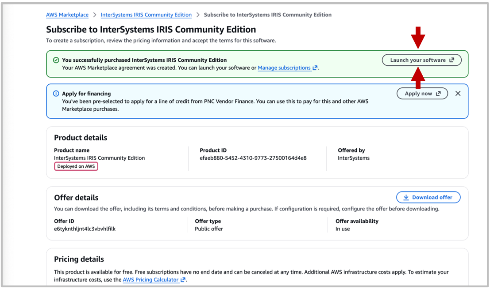

From here you can select your launch configuration and settings:

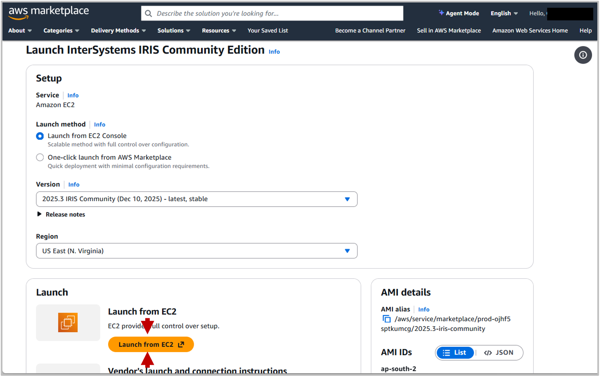

If you are not familiar with launching on AWS, it's recommended to use the `EC2 Launch Console`. Select this from the `Launch Method` and then click `Launch from EC2`

### EC2 Launch Console

The EC2 Launch console is where you define the settings for the Instance you are launching. You may wish to explore these settings in more detail yourself, but this guide will describe some of the core settings.

#### Name and Tags

These are used to recognise and identify the Instance. Organised naming and tagging is especially important if you are managing multiple AWS instances.

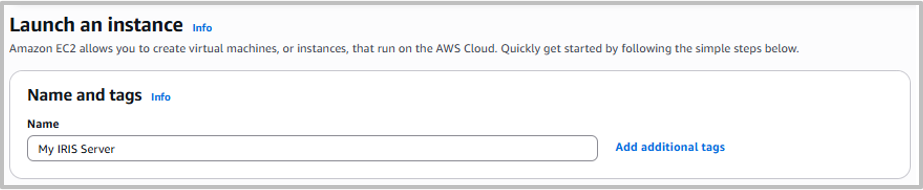

#### Application and OS Images (Amazon Machine Image)

This is where you select the virtual machine being run. If you have clicked through the InterSystems IRIS Community Edition marketplace page, you should have the correct Amazon Machine Image (AMI) already selected. Otherwise, you can select it from the catalog.

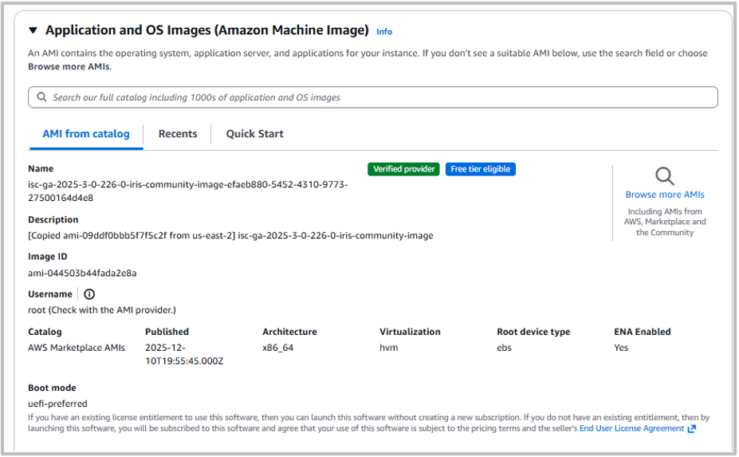

#### Instance Type

This is the hardware that InterSystems IRIS Community Edition will be running on. If you are a member of the free tier, you will be limited to small machines here. Choose your machine based on both workload size and budget, as more powerful machines will come at an increased cost.

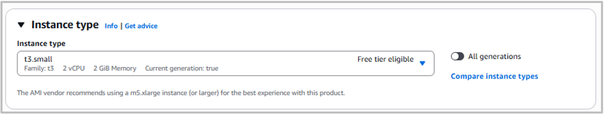

#### Key pair (Login)

The Key pair is the login key which you can use to connect to the instance via a Secure Shell connection (SSH). If you do not decide a Key pair here, you will not be able to log in via SSH. 
Then, create a Key pair, this allows secure SSH logins, this will download a Private Key which you can use to login.

Unless you have previously created a Key pair you will need to generate a new one. For this, click `Create new key pair`, and in the pop-up choose a key name (to identify it), an encryption method and a file format (if you are uncertain about these, leave them as defaults).

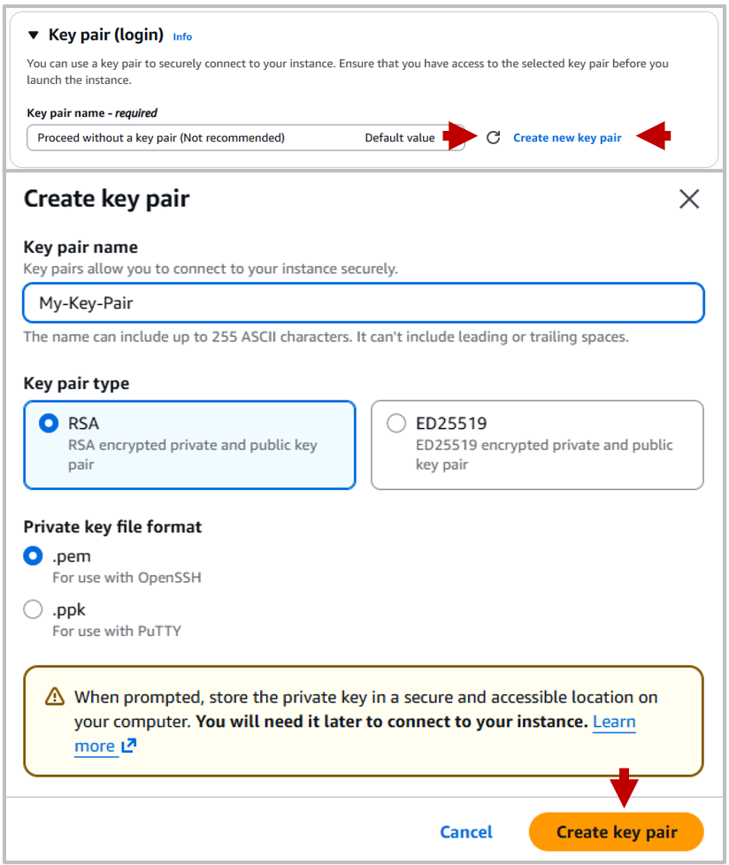

#### Network Settings

Here you can define some Network Security settings, like limiting which IP addresses can connect to your instance and allowing HTTP/HTTPS Traffic. Depending on your use case and security concerns, the appropriate settings will vary, so consider the required settings for your desired use.

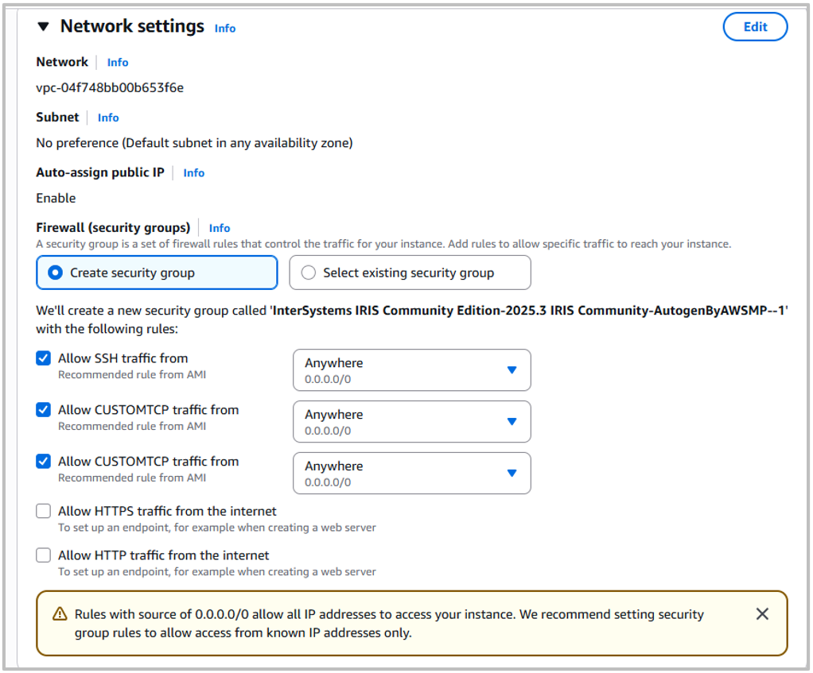

#### Storage

Choose the amount of storage needed for your instance. Note, the InterSystems IRIS Community Edition limits database storage to 10GB, so significantly more than this is unlikely to be required.

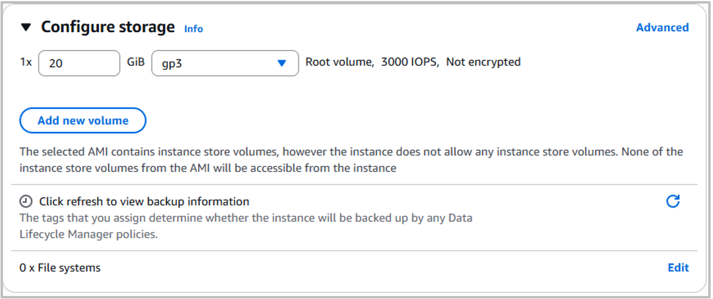

#### Advanced Details

There are a large number of additional settings available, including the ability to upload user data from the launch portal. These can be ignored for basic usage.

#### Launch Instance

After selecting your settings, click "Launch Instance" from the "Summary" panel on the right-hand side of the page.

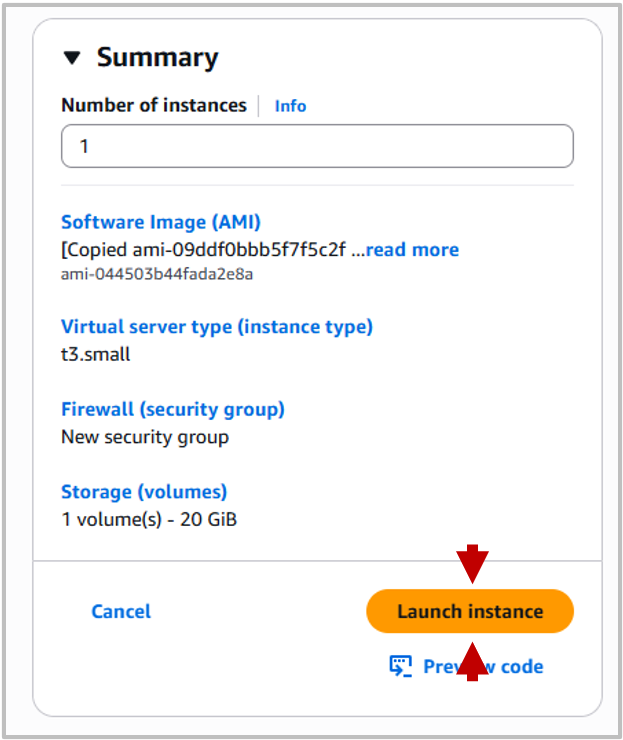

You instance will take a bit of time to launch and do appropriate status tests, but after that will be available online. 

### Connecting to session

Once you've started you instance, you can navigate to the instance summary by selecting the ID within the success message or navigating to the "Instances" dashboard from the left-hand panel.

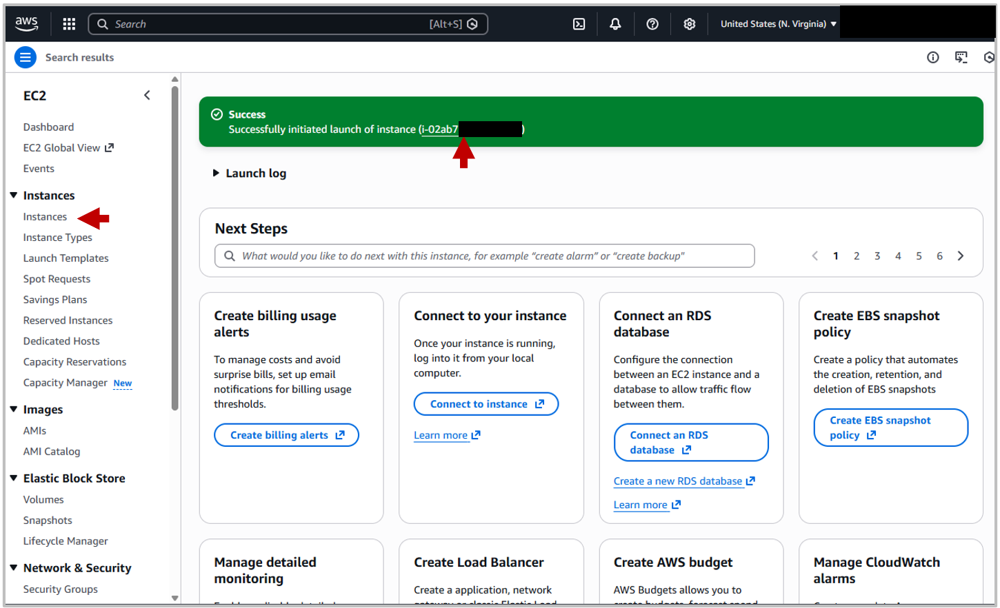

From the Instance Summary you can find the `Public IPv4 address` and `Public DNS`, either of which can be used to connect to the instance with SSH or as a web-server. The Public DNS is a redirect that routes to the IP address, so each option has the same result.

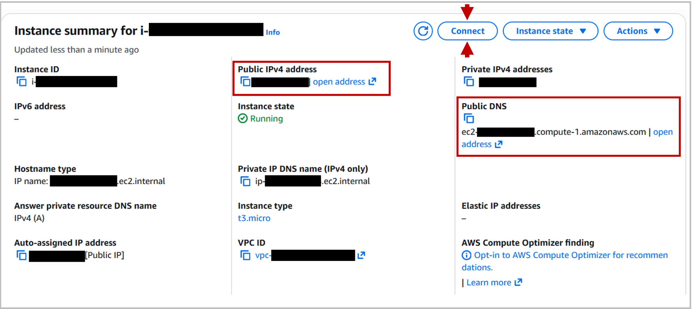

You can connect to the instance in different ways, some of which are described below.  

Whichever connection method you use, you will need to reset the password the first time you connect. The default credentials are:

- Username: _SYSTEM
- Password: SYS

If you are connecting from a command-line interface, change the password with:

```sh
iris password
```

and start an IRIS terminal with

```sh
iris session iris
```

Note, every time you open a new terminal connection, the entry message will include a reminder to change your password, but this is only required once.

#### EC2 Instance Connect

On the Instance dashboard is a large button within the instance summary to "Connect" (see screenshot above). Click this to open the connection portal. The first tab of this is the `EC2 Instance Connect` tab. You can leave the defaults in place and  click `Connect`. This will open a new terminal window.

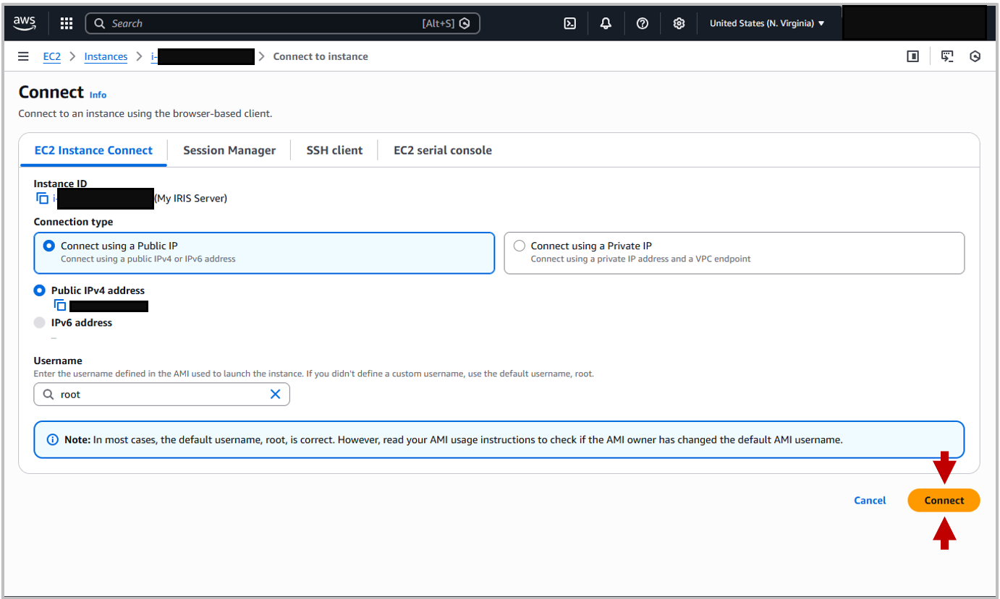


#### SSH Client

You can connect using SSH, using the Private key downloaded earlier and either the IP or DNS addresses listed under the instance summary. Please note, when connecting to your InterSystems IRIS isntance using SSH, you need to use the username `ubuntu`.

```bash
# Run to ensure key is not publically viewable
chmod 400 "My-Key-Pair.pem"

# Connect to instance using DNS
ssh -i "My-Key-Pair.pem" ubuntu@ec2-xx-xx-xx-xxx.compute-1.amazonaws.com

# Connect to instance using Public IP
ssh -i "My-Key-Pair.pem" ubuntu@xx.xx.xx.xxx
```

You can use an SSH connection to copy files to your instance using  `scp`, `sftp` or an SFTP client like FileZilla. For any of these, you will need to use your identify file as a key and "ubuntu" as the username.

#### Management Portal

You should be able to access the Management Portal at the DNS or IP addresses listed, unless the security settings you selected restrict this. To access the Management Portal, append `:52773/csp/sys/%25CSP.Portal.Home.zen` to the IP or DNS addresss and open in your browser. i.e. 

`"http://ec2-xx-xx-xx-xxx.compute-1.amazonaws.com:52773/csp/sys/%25CSP.Portal.Home.zen"`

`xx.xx.xx.xxx:52773/csp/sys/%25CSP.Portal.Home.zen`

Where `x` values are the server IP address.


### Terminating Instance

When you are finished working with your InterSystems IRIS Community Edition instance, consider terminating it to avoid excess charges. You can do this from the Instance Portal

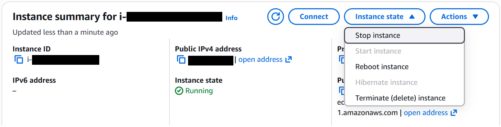


## Azure Walkthrough

To deploy an instance of InterSystems IRIS Community Edition in the cloud with Azure go to the [Azure marketplace listing](https://marketplace.microsoft.com/en-us/product/virtual-machines/intersystems.intersystems-iris-community?tab=Overview) and click `Get it now`.

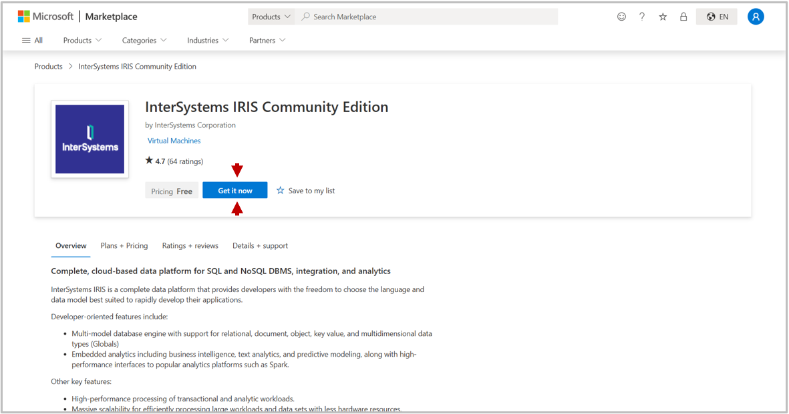

You will be prompted to sign in, and may also be asked for additional details like Country, Mobile number and workplace. Complete this and then click `Get it now` at the bottom of this form.

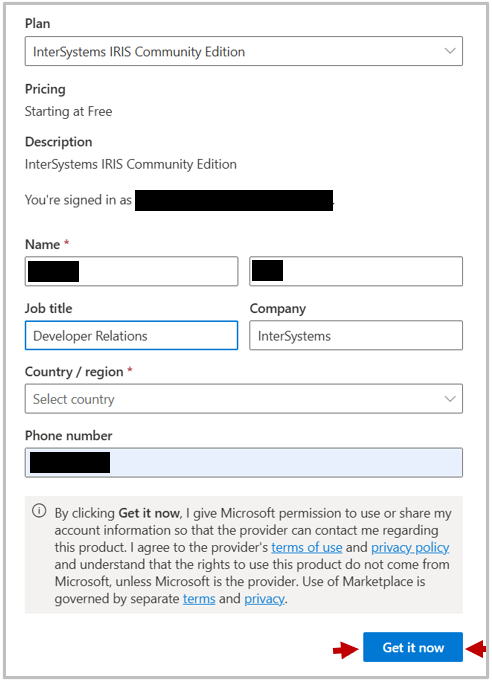

You will then be redirected to the Azure Portal. Click `Start with a pre-set configuration` to get started creating a deployment. If you'd rather select all the settings yourself, you can click `Create` and skip a default configuration.

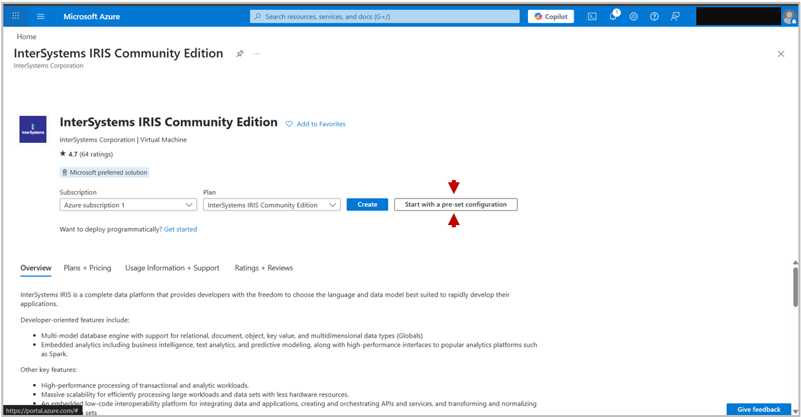

If you do not already have an Azure subscription associated with your account, you will be redirected to create a subscription. Azure offeres a first-time subscribed offer for free credits, allowing you to deploy for free. Complete the subscription process and return to the deployment.

After choosing to start with a pre-set configuration, you will be redirected to a page suggesting defaults for your use case. Choose your required use case, then click `Continue to Create a VM`, this choice will automatically pre-fill some of the configuration settings.

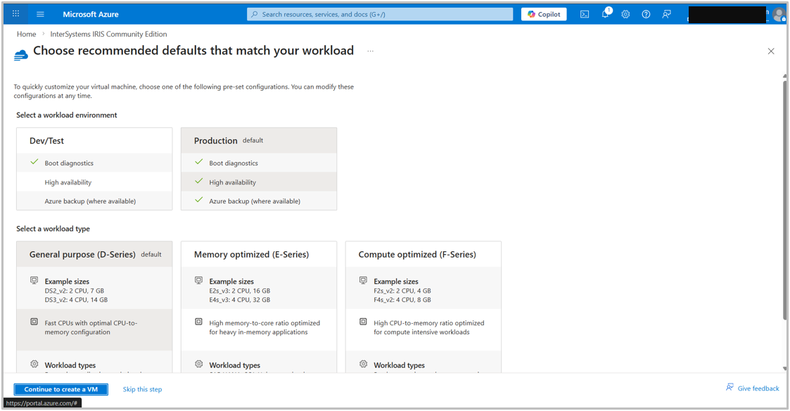


### Configuration settings

You will now enter the `Create a virtual machine` page. This is where you configure all of the settings for your virtual machine deployment. 

There are tabs to choose settings under `Basics`, `Disks` (storage), `Networking`, `Management`, `Monitoring`, `Advanced Settings` and `Tags`. This guide will discuss the settings under `Basics`. For the other settings, you can either leave them as the default if you've started with a pre-set configuration, or select them in your own time. Many of these can be changed after deployment (for example limiting the connecting IP addresses).

#### Project Details

Here you choose which Azure Subscription and Resource group is being used for the deployment, a resource group allows you to group related deployments (e.g. deployments for different services of a single project) for organisation and billing purposes. You will need to create a resource group if you have not done so before. Click `Create new` and give a suitable name. 

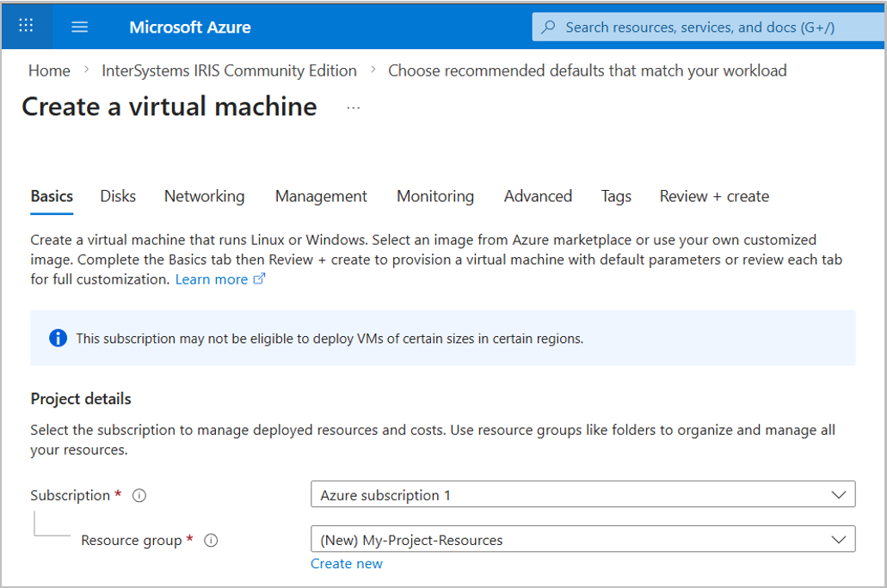


#### Instance Details

The instance details controls the size, location and security settings of the instance. As you have clicked through the Azure portal, the image should have been pre-filled. Otherwise, you can selected through the marketplace dropdown. 

There are several things to fill out in this section. 

- Give the virtual machine a name, preferably something easy to recognised.

-  Choose a Region. The closer the region is to your users, the less latency when accessing the machine. However, region choice will also affect availability of machines. 

- Size - The performance specifications of the machine, including memory and number/type of processors available (CPUs, GPUs).

The choice of size will depend on budget, required performance and availability in your selected region. As the InterSystems IRIS Community Edition itself limits the storage in the database and compute power used ([see the limits here](https://docs.intersystems.com/irislatest/csp/docbook/DocBook.UI.Page.cls?KEY=ACLOUD#ACLOUD_limits)), you will probably want to one of the smaller machines. 

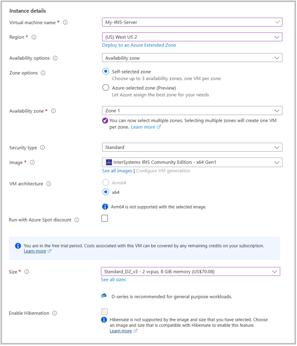


#### Authentication

Here you can choose how you authenticate when connecting to the machine. It's suggested that you use an SSH public/private key pair for this, but you can also use password authentication.

You can also select a default username to access the machine. You can leave all these settings as the default. If you choose to create a new SSH key, it will automatically be generated and downloaded when you deploy the machine.  

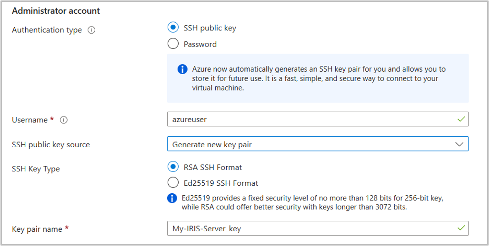


#### Review + Create

Once you have set the `Basics`, check through the other tabs of settings and see if there is anything you would like to change from defaults. If not, select the `Review + Create` tab. 

This tab will take a while to load, as it validates your selected settings. After validation has passed, you have to agree to the `Terms` for the final time, and will also see a summary of your selected settings.

When you are ready click `Create` to create your virtual machine.

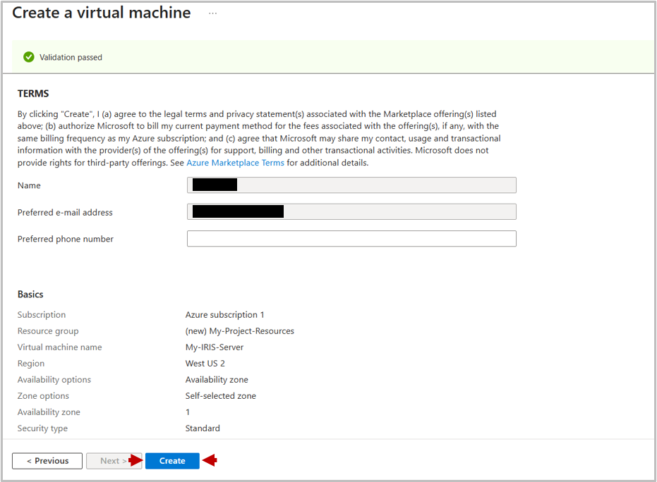

If you have selected to authenticate with an SSH key as suggested, you will be greeted with a pop-up to generate and download this. Click `Download private key and create resource`.

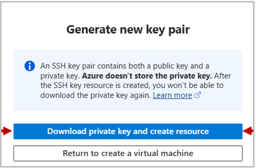

### Connection

It will take a couple of minutes for your deployment to launch, but you should end up with a screen saying `Your deployment is complete`.

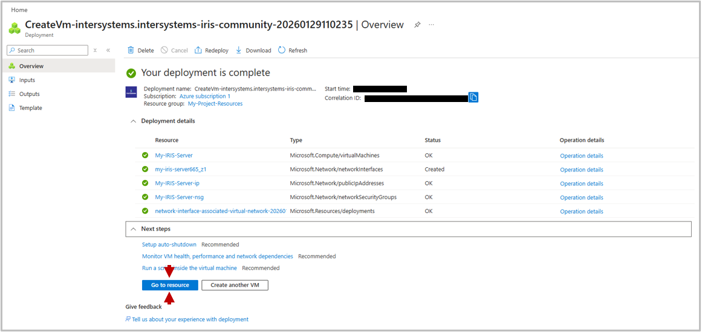

There are several settings which Azure recommendeds settomg, which you may wish to do soon. However, to initially demonstrate connecting to the machine, click `Go to resource`. This will bring up the management dashboard for your deployed virtual machine.

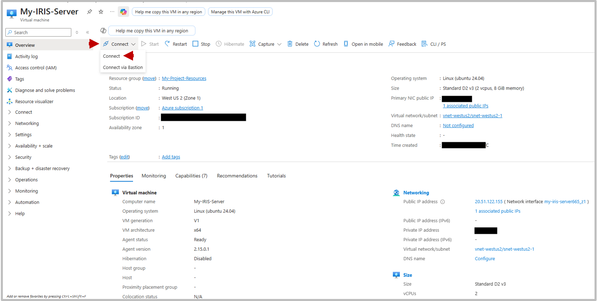


On the left-hand side there is a panel to select different settings groups to view and edit machine settings. For now though, Select `Connect` from the panel across the top of the dashboard.

### Via SSH

On Azure, SSH is the recommended method when connecting to the InterSystems IRIS Community Edition instance.

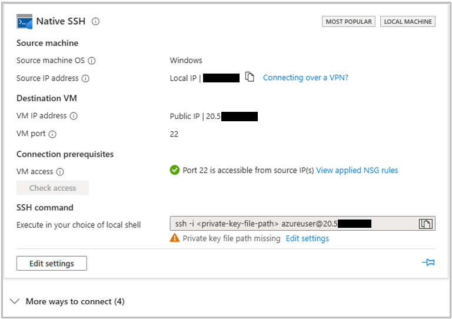

From the connection panel you will clearly see the IP address of your instance, and an SSH command to use to connect to the instance. The SSH connection command required three things, the local path to your private key which was downloaded when you launched the instance, the username on the machine (default was `azureuser` unless you changed it in the Authentication step above) and the IP address of your instance.

```sh
ssh -i /path/to/key.pem username@xx.xx.xxx.xxx

ssh -i /home/keys/My-Iris-Instance_key.pem azureuser@12.34.567.899
```

On your first time connecting, you will be prompted if you are sure you want to continue connecting. Type "yes" and you will connect to the instance.

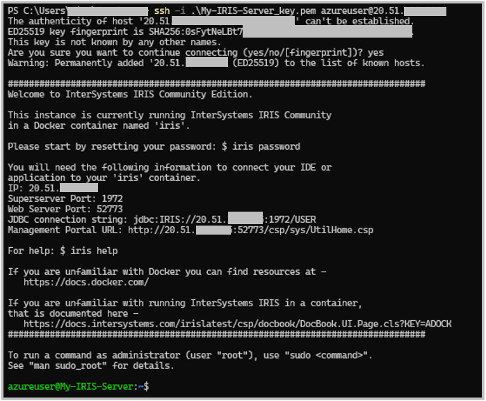

The first time you log in, you will need to reset the password from the default. To do this, run:

```sh
iris password
```

A prompt will tell you that the default credentials are:

- Username: _SYSTEM
- Password: SYS

And that this password is expired and needs to be changed.

After this, you can start an IRIS terminal session with:

```sh
iris session iris
```

If you would like to copy files to the IRIS instance, you can use an SSH connection using `scp`, `sftp` or an `sftp` client like Filezilla. You can also copy files via Azure's Bastion service.

### Via Management Portal

Once deployed, the Management Portal will be available at the IP address of your instance with ":52773/csp/sys/UtilHome.csp" appended on the end. The default credentials are: 

- Username: _SYSTEM
- Password: SYS 

These will need to be changed on first login, unless you have already changed them from the SSH connection. 


## Terminating 

When you are done evaluating InterSystems IRIS Community Edition on the cloud, it is recommended that you terminate the instance to avoid unwanted charges. To do so, navigate back to the Virtual Machine dashboard for your instance, and click `Delete`. You will be prompted for which components you want to delete. If you are completely finished using this deployment, select all of the components and click `Delete` to end all deployments.

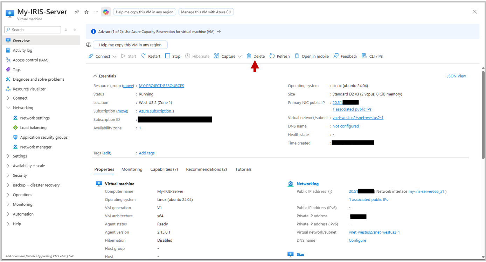