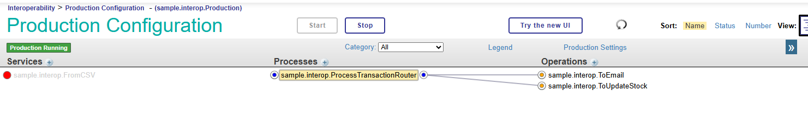
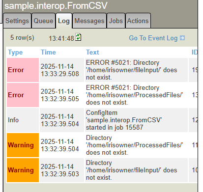
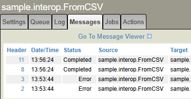
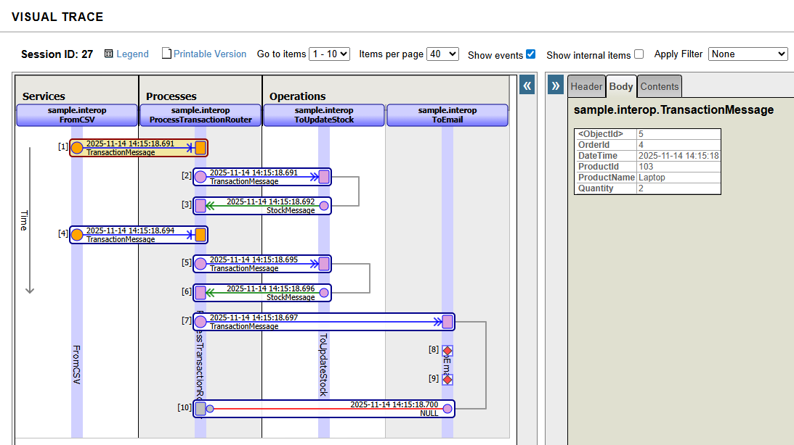
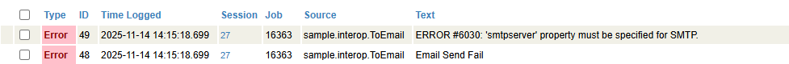

# Using The Production

In the previous guides we have gone through the creation of a production, followed by creating and configuring all the necessary components, including a `FromCSV` service, a `ProcessTransactionRouter`, a `ToUpdateStock` operation and a `ToEmail` operation. 

We have previously tested the Process and Operations using the testing features, but now we can see the entire interoperability production functioning. 

The first thing to do is start the production using the `Start` button at the top. A pop-up should appear logging that the production has started. 

We can compute the connections of each component by clicking on the dots next to each host. 



You may notice that the `FromCSV` file is not connected to the Business Process, this is because we have not hard-coded the message target, but have put it as a configurable setting. However, provided the MessageTarget setting is correctly given as `sample.interop.ProcessTransactionRouter`, it should connect correctly. 

### Checking Errors

You may  have a red dot for the `sample.interop.FromCSV` value. This means there is an error.  If so, check the event log for what is causing the error: 



These errors show that we have defined the directories for the file input and where we will move the file to, however we haven't created the directories. 

This can be fixed by creating these directories. Depending on how you are using InterSystems IRIS, how to create the directories may vary, but if you are using it within a docker container (called myiris), one way is to use a bash shell:

```sh
docker exec -it myiris bash
```

Then create the directories:

```sh
mkdir /home/irisowner/fileInput
mkdir /home/irisowner/ProcessedFiles
```

If you press the reload button or refresh the page, the `FromCSV` dot should turn green.

### Testing the production

To test the production, we can add a new transaction.csv file into our fileInput folder. We can create a transaction file with the following: 

```csv
ProductId,ProductName,Quantity
103,Laptop, 2
104,Desktop PC, 9
```

Save this as transaction.csv, then move or copy this file into the fileInput folder. Again, if you are running iris in a docker container, one method of doing so would be using `docker`: 

```sh
docker cp transaction.csv myiris:/home/irisowner/fileInput
```

The messages resulting from the production operation can be seen within the message log, by going to the _"Messages"_ panel within the settings. To see the messages going through each individual component, you can select the component. 



You can click any individual Message via the number in the "Header" column. This will open the "Visual Trace" for the entire session (passage from first activation of the Business Service to the end): 



The components are shown in columns with headers at the top, which each message being represented by a horizontal bar. The messages are shown in chronological order from top to bottom.

On the right hand side, we can see the content of each message. We can also see this in XML form using the `Contents` tab. 

Going through this trace from top to bottom we can see the following messages (by number):

1. `FromCSV` sends a message to `ProcessTransactionRouter`. This message shows a transaction of 2 laptops. 
2. `ProcessTransactionRouter` sends a duplicate message to `ToUpdateStock`
3. `ToUpdateStock` response with a `StockMessage` detailing that the current stock is 5. 

4-6. The same process as 1-3 occurs with the Desktop PCs transaction, however this time the current stock is 2.
7. As stock level is less than 5, another message gets sent to the `ToEmail` service. 

### Error logs

At this point, the `ToEmail` operation gives two errors, represented by red diamonds. These individual errors can be viewed by clicking on the red diamonds, or by viewing the event log, which can be found in the control panel for the `ToEmail` business operation. 

The errors are shown below: 



The first error is the automatic error, and arises because the SMTP server property has not been set. Although it was set in the Business Operation guide and the `ToEmail` operation was working when testing, it was deleted for demonstration purposes. 

The second error "Email Send Fail" is the error being logged within the ObjectScript Code. The source code for this operation includes the following: 


```objectscript
    // Use the outbound adapter to send the email
    set tSc = ..Adapter.SendMail(email)

    // Check if the email has been sent, and log upon failure
    if '$$$ISOK(tSc) $$$LOGERROR("Email Send Fail")
```

This performs `$$$LOGERROR("ErrorMessage")` if the email send status is not positive, in this case because the adapter was not configured correctly. 


## Conclusion

We have reached the end of this guide to building a basic Interoperability Production. This series has introduced all the important components and classes involved in an interoperability production, including the Services, Processes, Operations and Messages. Hopefully, this should have equipped you to start creating your own interoperability productions. 

More information about interoperability productions can be found within the [documentation](https://docs.intersystems.com/irislatest/csp/docbook/DocBook.UI.Page.cls?KEY=PAGE_interoperability), or through [learning services courses](https://learning.intersystems.com). The Learning Path [Building Business Integrations with InterSystems IRIS](https://learning.intersystems.com/course/view.php?id=1437) is a good place to start for this. 

Finally, questions about anything InterSystems related can always be asked on the [Developer Community](https://community.intersystems.com/). 