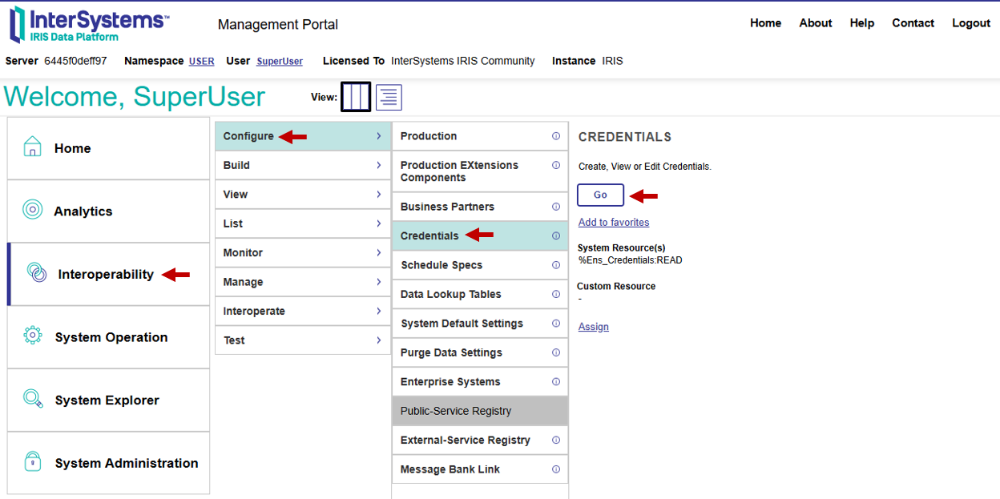
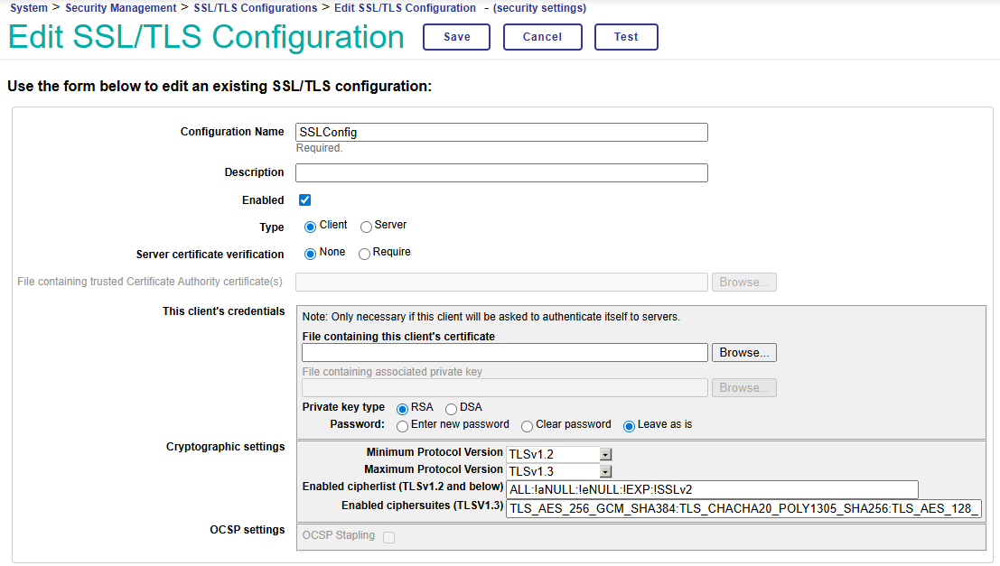
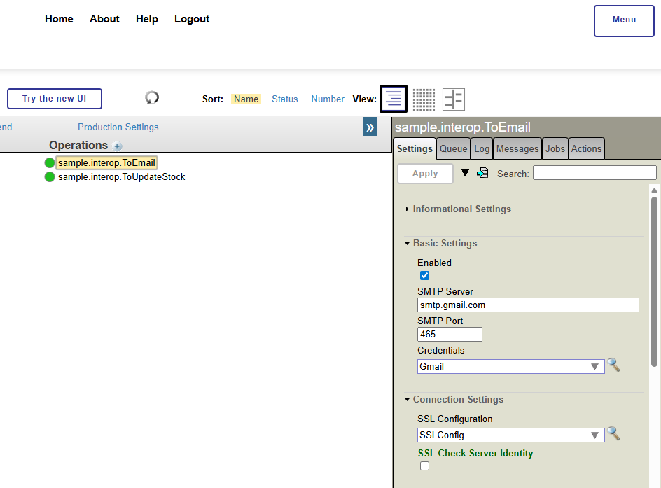
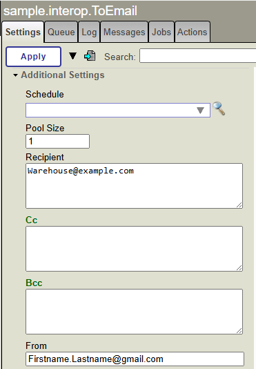

## Business Operations

Business Operations perform the downstream functions that result from incoming messages. They do not need to be endpoints, as they can pass information back to the business host that called them, generally a business process. Business Operations can therefore be called to supply additional information to a business process by querying a database. 

In this example, we are going to implement two business operations, updating the item stock databases, and sending low-stock warning. 

The Updating Stock operation therefore has two way information flow, as the result of this operation is returned to the business process. The low-stock warning operation has a single direction inforamtion flow, as information does not need to be sent back to the business process. 

### Business Operations Class

A basic Business Operations Class need three things to function: 

- It must extend the `Ens.BusinessOperation` superclass. 
- It needs a MessageMap defined 
- It needs one of more methods implementing the operation. 

#### Class declaration
Define a Business operations class as follows: 

```
Class sample.interop.ToUpdateStockDB Extends Ens.BusinessOperation{...}
```

#### Message Map
A Message Map is an XML specification which defines which method is called depending on the class of the Message which calls the operation. In this way, a business operation class could have different functionality in response to different incoming messages.  

A message map is defined as follows: 

```
    XData MessageMap
    {
    <MapItems>
        <MapItem MessageType="sample.interop.TransactionMessage">
            <Method>UpdateDatabase</Method>
        </MapItem>
    </MapItems>
    }
```

For each incoming message type, a `<MapItem>` is added with the message type defined as a paramater. This `<MapItem>` contains the `<Method>`, with the method name enclosed. 


#### Method

The method is defined with the method name given in the MessageMap. The input message is the first parameter of the method, while the response message can be defined using the keyword Output followed by a parameter name and message type. 

```
Method UpdateDatabase(pReq As sample.interop.TransactionMessage, Output pResp As sample.interop.StockMessage) As %Status
{...}
```

### Implementing the Methods

#### Updating Stock 

This process recieves the quantity, ID and and date-time of the transaction via a TransactionMessage, and updates the database accordingly. It then sends a response message (StockMessage) to the Business Process that send the incoming message, which contains the ID, name and current stock level of the product. 

This can be implemented by accessing the product in the database using an object Model (using the `.%OpenId()`) function, updating the values and saving it back to the database. The response message is defined as the output in the original parameters of the method, and is returned automatically upon quitting the method.

```
  Method UpdateDatabase(pReq As sample.interop.TransactionMessage, Output pResp As sample.interop.StockMessage) As %Status
    {
        // Open the stock item in the database
        set stockItem = ##class(sample.StockTable).%OpenId(pReq.ProductId)

        // Update the current stock
        set stockItem.CurrentStock = stockItem.CurrentStock - pReq.quantity
        
        // Update the last sale date
        set stockItem.LastSale = pReq.Datetime
        
        // Save the edited item
        set stockItem.%Save()

        // Create and populate the response message
        set pResp = ##class(sample.interop.StockMessage).%New()

        set pResp.CurrentStock = stockItem.CurrentStock
        set pResp.ProductId = pReq.ProductId
        set pResp.ProductName = pReq.ProductName

        // Quit with a OK status
        quit $$$OK
    }
```

Its worth noting here that there are no guard rails on overselling stock, and there is nothing to prevent the stock level going negative. There is also no error handling or error logging. These steps have been skipped for simplicity, as the aim of this guide is to create a very simple but understandable Interoperability Production. In a real-life environment, more error handling and stock amount processing would be needed.  

#### Sending an Email

The second business operation to be built is the operation that sends a warning email alert when the stock is low. This uses the outbound email adapter: `EnsLib.EMail.OutboundAdapter`. Outbound adapters work very similarly to InboundAdapters, that is to say they are set with the `ADAPTER` parameter of the class, this enables the usage of the adapter within methods using `..` notation. 

The settings for this adapter need to be configured to use an SMTP server to send emails which will be done from the Production Configuration portal. This will be discussed briefly below. 

This adapter is able to send instances of the `%Net.MailMessage` class, which have `text` and `subject` lines sent. 

```
    set email = ##class(%Net.MailMessage).%New()
    do email.TextData.Write("This is the message body")
    set email.Subject = "This is the email subject"
    set status = ..Adapter.SendEmail(email)
```

To implement this in our method, we need to include information from the call request message, this can be put in as a parameter. We also need to include a response message, although this does not need to be populated. 

```
Method SendEmail(pReq As sample.interop.TransactionMessage, Output pResp As Ens.Response) As %Status
{
    // Create a new email object
    set email = ##class(%Net.MailMessage).%New()
    
    // Create the string for the warning email
    set emailText = "Warning! Stock for "_pReq.ProductName_" (ProductID: "_pReq.ProductId_") Is running low. Currently, there are only "_pReq.Quantity_" Units left in stock."

    // Write the email text to the email object
    do email.TextData.Write(emailText)

    // Set the email subject
    set emailSubject = "Stock Warning PID: "_pReq.ProductId
    set email.Subject = emailSubject

    // Use the outbound adapter to send the email
    set tSc = ..Adapter.SendMail(email)

    // Check if the email has been sent, and log upon failure
    if '$$$ISOK(tSc) $$$LOGERROR("Email Send Fail")

    // Exit method returning the email send status    
    quit tSc
}

```

### Adding the Business Operation to the Production


#### Configuring gmail

This step is beyond the intended scope of the article, so this section is going to have limited details, it will focus on sending an email with a gmail server.  Depending on the email provider, the exact instructions will vary, but will likely be familiar. 

Simple Mail Transfer Protocol (SMTP) is an internet standard communication protocol for sending emails. Before filling out the configuration for this, we need to create Credentials used to Authenticate the application calls to the SMTP server.

##### Create Credentials
 To create credentials for an Interoperability Production, go to the Management Portal homepage and select 

`Interoperability -> Configure -> Credentials -> Go`



On the right hand side, you will see a panel to create a new set of credentials. To create a set of credentials, enter an identifier ID (name) for the credentials set (e.g. Gmail), then your User Name and Password. If using Gmail with 2FA turned on, you may need to use an App password. This is a password that allows limited access to applications without requiring 2FA for each access. 

Enter the credentials and then click save.


##### Create SSL config

You also need to create a configuration for how to handle SSL/TLS security. Again full description of this configuration are beyond the scope of this tutorial, this can be done by going to the homepage and then navigating to:

`System -> Security Management -> SSL/TLS Configuration -> Go`

The following shows the basic set-up used for this example:


#### Configure SMTP

We can now configure the SMTP settings in the in the ToEmail Business Operations. Firstly return to the Production Configuration Portal and click on the Business Operation to bring up the settings panel on the right hand side. 

To set this up with gmail, the following values need to be set in the Business Operation settings:

- SMTP Server: `smtp.gmail.com`
- Port: `587` for TLS or `465` for SSL
- SSL Configuration: Select `SSLConfig` from the dropdown (defined above)



##### Set Recipient and Sender

Finally you also need to the recipient (i.e. the email address the message is sent to) and the sender (the email address it is sent from). You can also define CC and Bcc as well.




## Next Steps

This page has worked through the creation of Business services, showing and example where a message is sent back to sender with information coming from a database query, and a final endpoint showing a connection to an external (email) service using an outbound adapter.

See below for the complete code of the classes created, or continue by creating a business process to call these operations. 


## Full Code

### Updating Stock


```
Class sample.interop.ToUpdateStock Extends Ens.BusinessOperation
{

XData MessageMap
{
<MapItems>
        <MapItem MessageType="sample.interop.TransactionMessage">
            <Method>UpdateDatabase</Method>
        </MapItem>
    </MapItems>
}

Method UpdateDatabase(pReq As sample.interop.TransactionMessage, Output pResp As sample.interop.StockMessage) As %Status
{
        // Open the stock item in the database
        set stockItem = ##class(sample.StockTable).%OpenId(pReq.ProductId)

        // Update the current stock
        set stockItem.Quantity = stockItem.Quantity - pReq.Quantity
        
        // Update the last sale date
        set stockItem.DateLastSold = pReq.DateTime
        
        // Save the edited item
        set sc = stockItem.%Save()

        // Log Error message if it fails to save
        if 'sc $$$LOGERROR(##class(%SYSTEM.Status).GetErrorText(sc))

        // Create the response message
        set pResp = ##class(sample.interop.StockMessage).%New()

        // Populate the response message
        set pResp.CurrentStock = stockItem.Quantity
        set pResp.ProductId = pReq.ProductId
        set pResp.ProductName = pReq.ProductName

        quit $$$OK
}
}
```

### Mail Operation

```
Class sample.interop.ToEmail Extends Ens.BusinessOperation
{

Parameter ADAPTER = "EnsLib.EMail.OutboundAdapter";

XData MessageMap
{
<MapItems>
        <MapItem MessageType="sample.interop.TransactionMessage">
            <Method>SendEmail</Method>
        </MapItem>
    </MapItems>
}

Method SendEmail(pReq As sample.interop.TransactionMessage, Output pResp As Ens.Response) As %Status
{
    // Create a new email object
    set email = ##class(%Net.MailMessage).%New()
    
    // Create the string for the warning email
    set emailText = "Warning! Stock for "_pReq.ProductName_" (ProductID: "_pReq.ProductId_") Is running low. Currently, there are only "_pReq.Quantity_" Units left in stock."

    // Write the email text to the email object
    do email.TextData.Write(emailText)

    // Set the email subject
    set emailSubject = "Stock Warning PID: "_pReq.ProductId
    set email.Subject = emailSubject

    // Use the outbound adapter to send the email
    set tSc = ..Adapter.SendMail(email)

    // Check if the email has been sent, and log upon failure
    if '$$$ISOK(tSc) $$$LOGERROR("Email Send Fail")

    // Exit method returning the email send status    
    quit tSc
}

}

```
