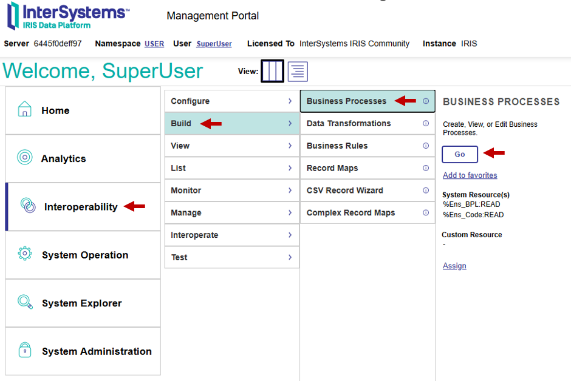
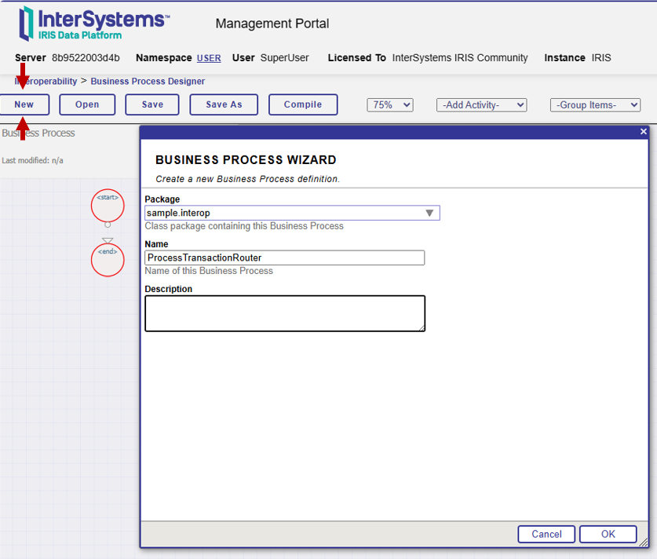
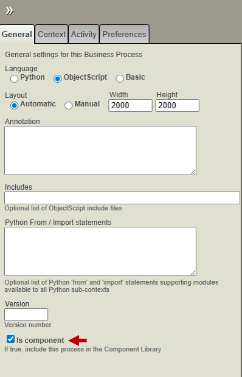
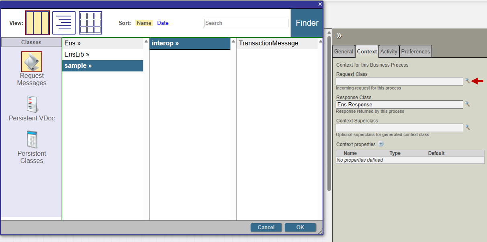
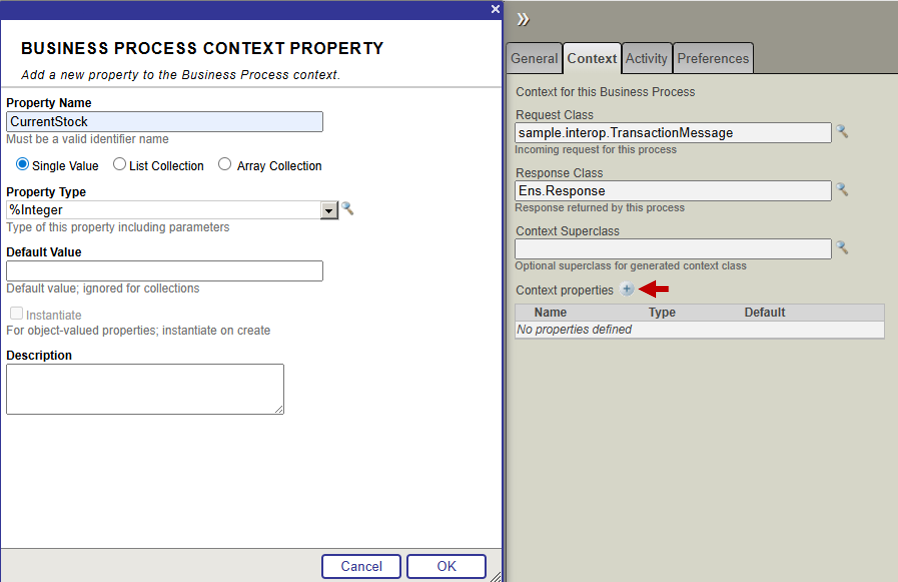
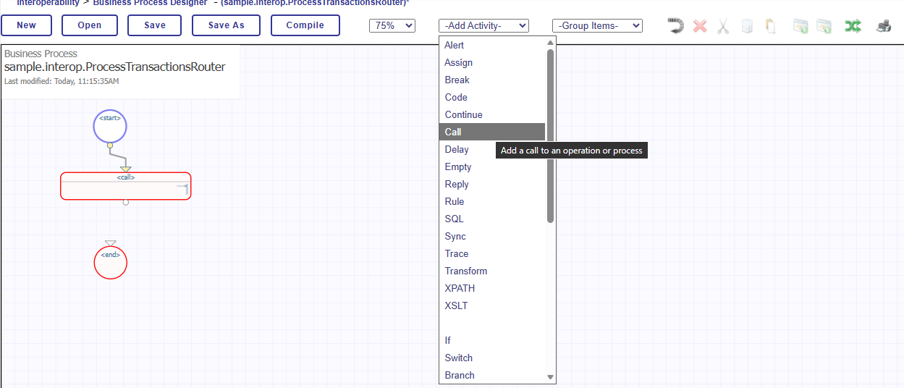

# Deprecated content
I started creating this but it felt like a nightmare to walk through the UI with text and images and much better served in video format, so I have linked learning services videos into the [main business process document](BusinessProcess.md) and then just ran through the XML encoded business process.  

## Using the Business Process Designer

Creating a BPL business process can be done through the Business Process Designer UI, which can be accessed by navigating from the Management Portal homepage: 

`Interoperability -> Build -> Business Processes -> Go`

To create a new Business Process, 

Then click `New` at the top left hand side, to open the `Business Process Wizard` window. Give the process a name and package. The name is the class name for the Business Process Class, while Package is the directory containing the class, as with any other InterSystems IRIS class. The package for this interoperability production has been `sample.interop`, so best to stick with that. Its good practice to have `Router` in the name of Business Processes that are designed to route messages, so a good name might be `ProcessTransactionRouter`. Add these, and then press ok. 

There is a settings panel on the right-hand side. Before starting building the routing rules, we need to change a number of these settings. 

Firstly, the `Is Component` tickbox needs to be clicked, this allows the new Business Process Language class to be used as a standalone component in the interoperability production. If this checkbox is not clicked, it will not be possible to add the component to the production. 

The other information we need to add here is under the `Context` we need to set the request class. This is the type of incoming message that is recieved by the Business Process. This class needs to be the `sample.interop.TransactionMessage` class we have already defined. This can be entered directly into the text-box or can be located by clicking the magnifying glass icon to the right of the textbox. 

We can leave the response class as the default, as no response message is required. 

We also need to add Context Properties. These are variables that only exist within the Business Process Scope, but are used to store values. We are going to use the Context properties to store the values that are recieved from the database update. 

To add Context Properties, click the `+` icon next to the Context Properties Option.

The only context property we require is the CurrentStock level. This is because it is the only required property that is not included in the original request message. 

### Building the routing rules

A business process can be viewed as a flowchart with a range of activities to create a process, including making calls to business operations, assigning values, creating conditional rulesets and creating loops. Our business process has a simple flow however: 

1. Recieve Message (Start)
2. Send a request message to `ToUpdateStock` Operation
3. Receive Updated Stock Values 
4. If Updated Stock Value is less than 5
    - Send Request message to `ToEmail` 

We build each process out using the `-Add Activity-` dropdown at the top of the page. By default, activities will be connected to the activity that is already selected, so select the `Start` icon in the flowchart before adding your first activity. You can also connect activities by drawing a line from the small circle at the bottom of each activity bubble.

The first activity to add is a `Call` to the Business Operation `ToUpdateStock`
