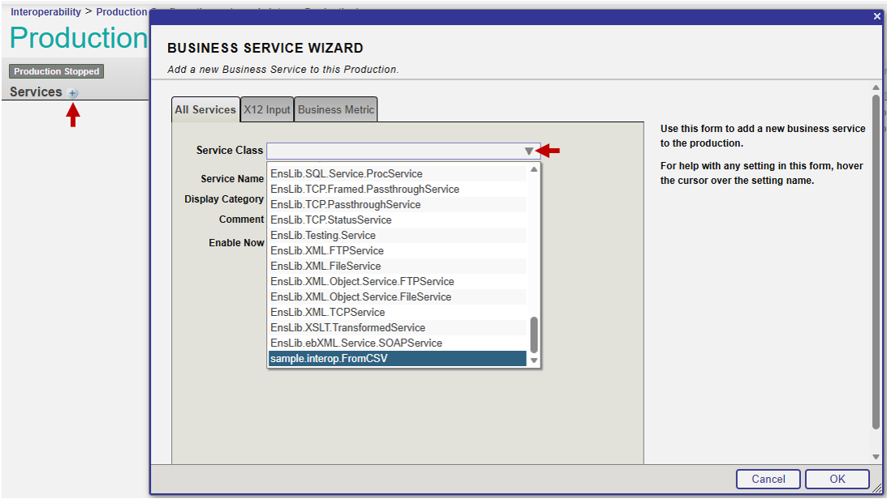
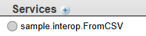
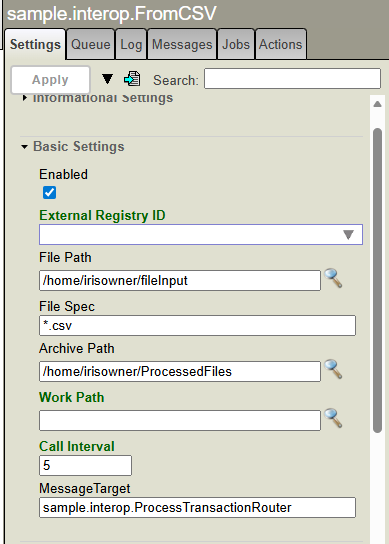

# Business Service
This page guides through the building of a Business Service class which uses an Inbound Adapter to Read files which are placed in a certain directory, and populate and send messsages based on this. 

Business services should have very simple functionality that is restricted to only populating and sending messages with the input recieved. Data transformations and conditional operations should be handled by a Business Process to ensure that the data can be properly tracked and logged. 

The service class should extend the superclass `Ens.BusinessService`.

### Using an Inbound Adapter
The business service is the process which populates the transaction request message we have created. To do this, an **Inbound Adapter** is required. The adapter recieves the data coming into the production. Inbound adapters could recieve data from one of the following examples: 

- Reading a file 
- REST Request
- Email 

There are a wide number of inbound adapters availble, but its also possible to create custom adapters using the `Ens.InboundAdapter` superclass. 

Inbound adapters commonly require additional settings, like for a File adapter it needs a directory and a file name pattern to watch for files. When a business service uses an adapter, these adapter settings are made available within the Production Configuration portal. The inbound adapter in use needs to be set using the ADAPTER parameter: 

```
Parameter ADAPTER = "EnsLib.file.InboundAdapter";
```

### Adding Configureable settings

We can  add configurable settings to the Business Service (or any other component) by creating properties for the settings, then adding them to the SETTINGS parameter. In this example we are going to make the message target configurable, this is the business process that the message will be sent to. To do this, we add 

```
Property MessageTarget As %String;
```
To create the property which the setting is stored in. Then the property can be added to the configuration settings with: 

```
Parameter SETTINGS = "MessageTarget:Basic";
```
The term ":Basic" means that this will be added to the Basic Settings portion of the Production Configuration Settings.  

### Defining Logic

The actions behind the business service are defined using the `OnProcessInput` method, this is the function which is activated by the Inbound Adapter. In our case, the adapter is activated by detecting a file in the directory it is watching (defined by the FilePath Setting). The adapter reads this file and passes it to the business service as a `%Stream.FileCharacter` Object, which is the text-file object. We therefore define the `OnProcessInput` with the following:

```
Method OnProcessInput(pInput As %Stream.FileCharacter) As %Status
{...}
```

The method needs to:

1. Create an order number for the whole transaction - this can be done by incrementing a global. 
2. Loop over each line of the CSV file and: 
    
    3. Populate a new TransactionMessage with the values from each line, as well as the Order Number 
    
    4. Add the Date and Time of Processing
    
    5. Send each message Asynchronously (without waiting for a response)

These can be implemented in the following way: 

#### Create an order number: 

```
    // Increment the Order ID
    set OrderId = $Increment(^OrderCounter)
```
#### Read each line of CSV file: 
The file is read into the `pInput` parameter of the `OnProcessInput` method. The lines of the file can be read wth the `.ReadLine()` file. 

As a CSV file has a line which contains headers, we need to read a line 

```
// Read the headers line of the csv file
set headers = pInput.ReadLine()

while 'pInput.AtEnd{  // Iterate over each line until the end of the file
    set line = pInput.ReadLine()

    // ... Populate and send message
 } 
```

#### Populate the message
This uses `$Piece(line, "," , n)` to split each line by commas and access each value with its position `n` (note indexing starts at 1, not 0). 

It also requires some rudimentary data handling using the `$ZString(<string>, "*W")` function to strip the whitespaces and the unary operator `+` to convert the string to an integer

There are more sophisticated ways to handle CSV files, for example using the [CSV Record Wizard](https://docs.intersystems.com/iris20252/csp/docbook/DocBook.UI.Page.cls?KEY=EGDV_recmap#EGDV_recmap_create_wizard), but for this introductory guide, we will stick to the rudimentary CSV parsing. 

```
        // Create a new message for each transaction line
        set msg = ##class(sample.interop.TransactionMessage).%New()
        
        // Set the Order ID as the transaction order ID
        set msg.OrderId = OrderId

        // Set the values from the line of the csv file
        set ProductId = $Piece(line, ",", 1)
        set msg.ProductId = +$ZStrip(ProductId, "*W")

        set msg.ProductName = $Piece(line, ",",2)
        set Quantity = $Piece(line, ",", 3) 
        set msg.Quantity = +$ZStrip(Quantity, "*W")
```

#### Add the Date/Time of Processing
We can access the current date and time with the shortcut `$HOROLOG`. This gives the current date an time in an uninterpretable format: the number of days since records began (arbitrarily Jan 1 1841), and the number of seconds since the start of the day.

To convert this into a usable date string, we can use `$ZDATETIME()`, this takes the `$HOROLOG` format date and time. You can also add formats for the outputted date and time, here we will pass in `3` to specify that we want the date in ODBC format, which is "YYYY-MM-DD". The time is by default outputed as "hh:mm:ss". 

There are equavalents for $ZDATE, $ZTIME and various other useful date-time functions in [the documentation](https://docs.intersystems.com/irislatest/csp/docbook/Doc.View.cls?KEY=RCOS_vhorolog), but for now we can use `$ZDATETIME($HOROLOG,3)` to get the datetime. 

```
        // Add the processing date and time as an ODBC format datetime string
        set msg.DateTime = $ZDATETIME($HOROLOG, 3)
```
### Sending the message

Messages can be sent with the inherited `Ens.BusinessService` method `SendRequestAsync()`, this takes in two parameters, the target (where the message is sent, commonly a business process) and the message itself.

Asynchronous requests mean that the program will not wait for a response before proceeding to the next step. If a process should await a response, `SendRequestSync(pTargetDispatchName, pRequest, .pResponse, pTimeout)` can be used instead.

The `..` syntax means the `SendRequestAsync` and the `MessageTarget` property are both coming from the parent class, rather than having been defined within the `OnProcessInput` method. 

```
       // Send Asynchronous request
        set st=..SendRequestAsync(..MessageTarget, msg)
```

We can check that the message has successfully been sent: 
```
        if ('st){
        $$$LOGERROR("Cannot call Process for ProductID "_$Piece(line, ",", 1))
        }
```

`$$$LOGERROR()` is a shortcut to log an error to the Event log in the Production Configuration Portal, which can help provide some context to the error. Its also possible to log information, warnings or status codes (`$$$LOGINFO()`, `$$$LOGWARNING()` and `$$$LOGSTATUS()`) which can be helpful for debugging purposes. 

## Adding FromCSV service to Production

To add the Business Service to the production, open the Production configuration portal and click the `+` next to services. This will open the `Business Service Wizard`. Choose the `sample.interop.FromCSV` service class from `Service Class` dropdown. You can give the service a name or leave it blank - the default name is just the name of the class. Nothing else is required, so Click `OK` to add the service to the production. 



Once added, it will appear in the list of Business Services with a grey dot. 



The color of the dot represents the status of the component: 
- Grey - disabled
- Light green - enabled but not in use
- Dark green - enabled and running
- Red - it has one or more errors.

Before this Business Service can function, we need to define the following: 

- File Path - The directory to watch for new transaction files coming in
- File Spec - The file pattern to look for.
- Archive Path - The directory to put the processed files into. 
- MessageTarget - The business process where the message is sent. This was the setting we defined in the service class using the `SETTINGS` parameter. 

There are also some additional settings, including the frequency at which it checks for a new file and the number of pooled transaction files before this job functions. For now though, we are only going to worry about the essential settings above. 

To see the settings, click on the new Business Service in the list. The setting panel should open on the right hand side. Scroll to basic settings and fill out as follows: 

We define: 

- File Path: /home/irisowner/fileInput 
    - This is the In-file directory. Change this to the location on your system. If the directory does not exist, the service will error, so make sure to create the directory.
- File Spec: *.csv
    - This is the pattern of file which the adapter is looking for. * is a wildcard character, meaning any number of letters before ".csv", the file extension. 
- Archive Path: /home/irisowner/ProcessedFiles
    - This is the location the original files are moved to after processing. As with the File Path, this directory needs to exist, so change it on your system. 
- MessageTarget: sample.interop.ProcessTransactionRouter
    - This is the name of the business Process we will send our TransactionMessages to. As defined and added in the last step. 

We also click the `Enabled` checkbox to enable the business service. 




## Next Steps

We have now finished creating all the components in the production. In this step we have implemented a Business Service that uses an inbound adapter to read a csv file dropped in the `/home/irisowner/fileInput` directory and sends a message to our business process, `sample.interop.ProcessTransactionRouter`. 

The full code for the class is availble below. 

The final guide of the series, [UsingTheProduction](UsingTheProduction.md) demonstrates how this production can be used, including testing the business service. 

### Full Class
```
Class sample.interop.FromCSV Extends Ens.BusinessService
{

// Define the Inbound Adapter

Parameter ADAPTER = "EnsLib.File.InboundAdapter";

// Create a property for the message target (i.e. where the messages will be sent)

Property MessageTarget As %String;

// Add the message Target to message settings. 

Parameter SETTINGS = "MessageTarget:Basic";

Method OnProcessInput(pInput As %Stream.FileCharacter) As %Status
{
    // Increment the Order ID
    set OrderId = $Increment(^OrderCounter)
    
    // Read the headers line of the csv file
    set headers = pInput.ReadLine()

    while 'pInput.AtEnd{
        set line = pInput.ReadLine()

        // Create a new message for each transaction line
        set msg = ##class(sample.interop.TransactionMessage).%New()
        
        // Set the Order ID as the transaction order ID

        set msg.OrderId = OrderId
        
        // Add the processing date and time in ODBC format
        set msg.DateTime = $ZDATETIME($HOROLOG, 3)

        // Set the values from the line of the csv file
        set ProductId = $Piece(line, ",", 1)
        set msg.ProductId = +$ZStrip(ProductId, "*W")

        set msg.ProductName = $Piece(line, ",",2)
        set Quantity = $Piece(line, ",", 3) 
        set msg.Quantity = +$ZStrip(Quantity, "*W")

        // Send Asynchronous request
        set st=..SendRequestAsync(..MessageTarget, msg)

        if ('st){
        $$$LOGERROR("Cannot call Process for ProductID "_$Piece(line, ",", 1))
        }
        
    }
    quit $$$OK
}
}
```