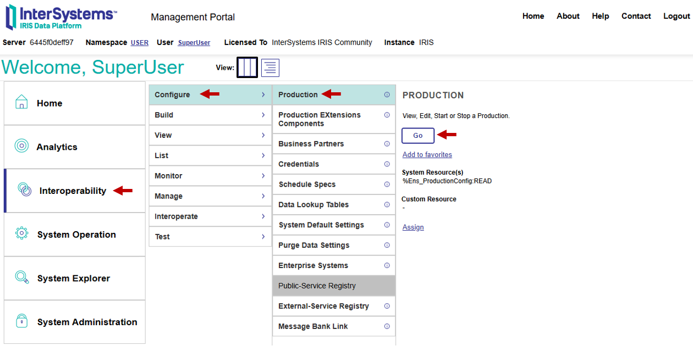
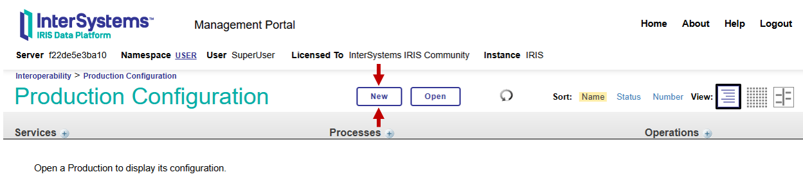

# Interoperability

Interoperability is the ability for systems and devices to seamlessly interact, work together and exchange information across different platforms and standards. 

An example of an interoperability system is an automated loan application checking service. A user submits an application, leading to automated queries to different loan providers to check what loan they could provide. Finally the interoperable system might provide a response to the user in the form of sending an email. At several points in this system, there may be rules-based processes, e.g. to check the outcome of a loan request before writing an acceptance or denial email. 

In InterSystems IRIS, an interoperable system, or production, is completed by three main process types: 

- Business Services
    - Responsible for recieving incoming signals.
    - Loan example: the Business Service would recieve the data from the submitted form.

- Business Processes
    - Responsible for conditional routing of messages, as well as required transformations of data. 
    - Loan example: Processes would send the required data to operations to check different loan providers, and apply conditional logic to call acceptance or rejection email operations.

- Business Operations
    - Responsible for Downstream processes, this may include intermediate processes like querying a database before the final outputs.
    - Loan example: Responsible for querying loan providers and sending decision email.

There are two other crutial components: 

- Adapters 
    - These are connectors that help read input data (inbound adaptors) or create output data in a suitable format (outbound adaptors).
    - Loan example: A JSON adapter may read data that has been submitted via POST request to a REST endpoint. 

- Messages
    - These contain the information being passed between the different components. 

(Placeholder image)


Adapters - [Wide range of adapters available but also possible to create their own](https://docs.intersystems.com/irislatest/csp/docbook/DocBook.UI.Page.cls?KEY=EGIN_options_connectivity).


# Creating a simple Interoperability Production


This guide walks through the creation of a simple code-first interoperability production to show how these productions can be built.

 While this guide focuses more on the code underlying the production, its worth noting that a key value of the InterSystems IRIS Interoperability Production system is the productions can be configured, messages tracked and settings changed, within a low-code user interface. Therefore, alongside the code shown throughout this guide, the Production Configuration page of the management portal will also be shown, with various settings being configured from here. To access this page, go to: 

 http://localhost:52773/csp/user/EnsPortal.ProductionConfig.zen?$NAMESPACE=USER& 

 (Assuming the IRIS instance is mapped to local port 52773, and the production is in the user namespace).

 Or navigate directly from the management portal homepage with: 

Interoperability -> Configure -> Production -> GO 




## Design Brief:

The aim of this walkthrough is to design a system to process transactions. This system will be very simple, but will guide the process of building a simple interoperability production with InterSystems IRIS. The process is as follows: 

1. A transaction is initialized by a csv file with the order details being added to the Transactions folder.
2. Business service reads the transaction data (via an Inbound adapter) and sends a request to a Business Process
3. The Business process sends a request to a Business Operation to update stock. 
4. The Business Operation sends a response with the updated stock values.
5. The Business Process checks if any of the updated stock values are less than 5, if so, sends a low-stock warning email.


Interoperability productions are built from classes, as is standard within InterSystems IRIS. Each component is generally a separate class, unless there are multiple components 

To build this production, we need the following components: 

1. FromCSV Business Service
2. Transaction Routing Business Process
3. Stock updating Business Operation
4. Low-Stock email Business Operation

And the following messages: 

1. Transaction Request. This can be reused between the business service and the business process, and between the business process and the stock updating business operation.
2. Updated stock response.

The transaction data is going to have the following: 

|ProductID|ProductName|Quantity|
|-|-|-|
|101|Keyboard| 1|
|102|Monitor| 2|

And the stock table will have the following details: 

| DateLastSold | ProductId | ProductName    | Quantity |
|--------------|-----------|----------------|----------|
|              | 101       | Computer Mouse | 17       |
|              | 102       | Monitor        | 13       |
|              | 103       | Laptop         | 7        |


An additional consideration is that there are many different parts to be built. The example being defined here has four different Business Hosts, two message type, a persistent class to create the data table, and the production setting file itself. While the order laid out in this guide is logical, it is by no means the only correct order to create an interoperability production. In fact, a similar guide available on the [developer community](https://community.intersystems.com/post/intersystems-iris-first-time-let%E2%80%99s-use-interoperability) used almost the exact reverse order.

Each of these classes are going to be individually defined below, together with some details on the process behind their design. For the full coded example, see [final github link](). Alternative examples can be found at: [loan demo link](), [Reddit demo link]().


## Creating the StockQuantity database

Before starting to create our production, we will make the data table which stores our stock inforemation.

To create the stock database, we can use a perisistent class. To keep it simple, we only need the ProductId,  ProductName, Quantity in stock, and date last sold. To make it easier to populate the table, we will also add a class method which creates a new object and saves it to the table. 

```
Class sample.StockTable Extends %Persistent
{

Property ProductId As %Integer [ Required ];

// Set the Product ID to be the Index 
Index ID On ProductId [ IdKey ];

Property ProductName As %String;

Property Quantity As %Integer [ Required ];

Property DateLastSold As %DateTime;

ClassMethod CreateNew(pid As %Integer, pName As %String, quantity As %Integer) As %Status
{
    // Create new item
    set newItem = ##class(sample.StockTable).%New()

    // Populate the information based on method call parameters
    set newItem.ProductId = pid
    set newItem.ProductName = pName
    set newItem.Quantity = quantity

    // Save the item 
    set sc = newItem.%Save()
}
}

```

### Populating table 

Now we have saved the above class, we can populate the table by running the following in the IRIS command line (ensure it is in the USER namespace): 

```
do ##class(sample.StockTable).CreateNew(101, "Computer Mouse", 17)
do ##class(sample.StockTable).CreateNew(102, "Monitor", 13)
do ##class(sample.StockTable).CreateNew(103, "Laptop", 7)
do ##class(sample.StockTable).CreateNew(104, "Desktop PC", 11)
do ##class(sample.StockTable).CreateNew(105, "Keyboard", 11)
```

Now, we can open the SQL Editor at [http://localhost:52773/csp/sys/exp/%25CSP.UI.Portal.SQL.Home.zen?$NAMESPACE=USER](http://localhost:52773/csp/sys/exp/%25CSP.UI.Portal.SQL.Home.zen?$NAMESPACE=USER) and view the table with:

```
SELECT 
ID, DateLastSold, ProductId, ProductName, Quantity
FROM sample.StockTable
```
Which outputs the following table 

|  ID  | DateLastSold | ProductId | ProductName    | Quantity |
|------|--------------|-----------|----------------|----------|
| 101  |              | 101       | Computer Mouse | 17       |
| 102  |              | 102       | Monitor        | 13       |
| 103  |              | 103       | Laptop         | 7        |
| 104  |              | 104       | Desktop PC     | 11       |
| 105  |              | 105       | Keyboard       | 11       |


# Creating the Production

A good first step is creating the production, as this is required to add settings to the production components. To create a new production, open the [Production Configuration Portal](http://localhost:52773/csp/user/EnsPortal.ProductionConfig.zen?$NAMESPACE=USER&) and click `New` at the top of the page.



You will be greated with the following pop-up.


The files for this guide are going to be saved in the sample.interop package, so this is a sensible place for the production to live. Enter `sample.interop` in the Package box. You can also give the production a name and description. The production name can be generic, e.g. "Production", and the description is optional, but it is always good practice to use names and descriptions that make it easier to understand what the production is for. 


[naming conventions](https://docs.intersystems.com/iris20252/csp/docbook/DocBook.UI.Page.cls?KEY=EGBP_routing_best_practices#EGBP_naming_conventions)


# Transaction Request Message

Messages are often a good place to begin when coding an interopability production, because they define the information that passes between business hosts.

Messages are generally stored in tables to allow them to be tracked and searched. For this reason, messsages should extend the `%Persistent` superclass to allow it to be saved to a database, as well as the `Ens.Request` or `Ens.Response` superclasses. 

Messages are also recommended to extend `%XML.Adatper` as this allows the messages to be viewed in XML format the management portal.

We are going to simply create a message that has the columns within the original transaction CSV, as well as an additional value for Order ID, so the messages can be grouped by order ID in future, and a DateTime value to keep track of the date at which the order was processed. 

Note, we are making a design choice to send a single message for each row of the CSV file. This design makes sense as we can update the stock for each item in the transaction individually. In other systems however, it may make sense to include all the data in the original file as a single message. 

```
Class sample.interop.TransactionMessage Extends (%Persistent, Ens.Request, %XML.Adaptor)
{

    Property OrderId As %Integer;

    Property DateTime As %String;

    Property ProductId As %Integer;

    Property ProductName As %String;

    Property Quantity As %Integer;

}
```

We will also define a response message to return information on the current stock level from the business Operation. 

```
Class sample.interop.StockMessage Extends ( %Persistent, %Ens.Response, %XML.Adapter)
{
    Property ProductID As %Integer;

    Property ProductName As %Integer; 

    Property CurrentStock As %Integer;
}
```


## Business Process

Now we have the functions at either end of the production, the next to do is connect them using a conditional routing process. The rules behind the message routing are simple. When a message arrives, the `ToUpdateStockDB` operation needs to be called synchronously to recieve the output of the new stock number. If the resulting stock is low, in this example we shall put a limit of 5 units, the business process sends an additional call to `ToEmail`. 

The easiest way to create business processes is using Business Process Langauge, which defines rules in XML data, but can be easily built using the graphical user interface (GUI) in the management portal.


```xml
Class sample.interop.ProcessTransactionRouterRules Extends Ens.Rule.Definition
{
    Parameter RuleAssistClass = "EnsLib.MsgRouter.RuleAssist"

    XData RuleDefinition [ XMLNamespace = "http://www.intersystems.com/rule ]
    {
    <ruleDefinition alias="" context="EnsLib.MsgRouter.RoutingEngine" production="sample.interop.Production">
    <ruleSet name="" effectiveBegin="" effectiveEnd="">
    <rule name="">
    <constraint name="msgClass" value="sample.interop.TransactionMessage"></constraint>
    <call name="CallUpdateStockDB" target="sample.interop.ToUpdateStockDB" async=0>
        <request type="sample.interop.TransactionMessage">
            <assign property="callrequest.ProductId" value="request.ProductId" action="set" />
            <assign property="callrequest.ProductName" value="request.ProductName" action="set" />
            <assign property="callrequest.Datetime" value="request.Datetime" action="set" />
            <assign property="callrequest.Quantity" value="request.ProductQuantity" action="set" />
        </request>
        <response type="sample.interop.StockMessage">
            <assign property="context.Stock" value="callresponse.CurrentStock" action="set" />
            <assign property="context.ProductId" value="callresponse.ProductId" action="set"/>
            <assign property="context.ProductName" value="callresponse.ProductName" action="set"/>
        </response>
    </call>

    <if condition="context.Stock &lt; 5">
        <true>
            <call name="CallToEmail" type="sample.interop.ToEmail">
                <request type="sample.interop.TransactionMessage">
                    <assign property="callrequest.ProductID" value="context.ProductId" action="set"/>
                    <assign property="callrequest.ProductName" value="context.ProductName" action="set"/>
                    <assign property="callrequest.Quantity" value="context.Stock" action="set"/>
                </request>
            </call>
        </true>
    </if>
    <return></return>
    </rule>
    </ruleSet>
    </ruleDefinition>
    }
}
```


