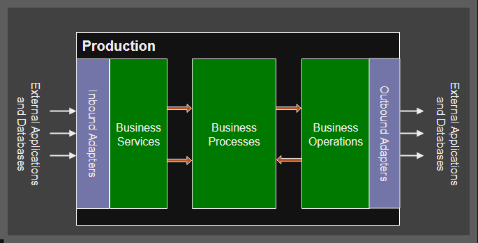
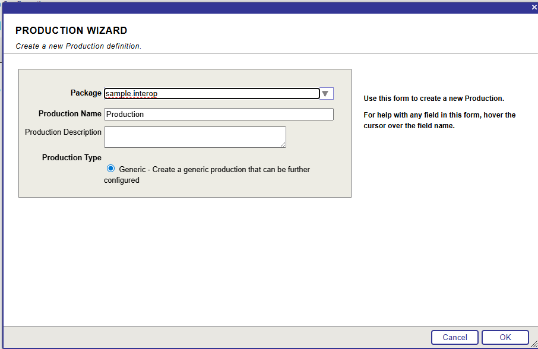
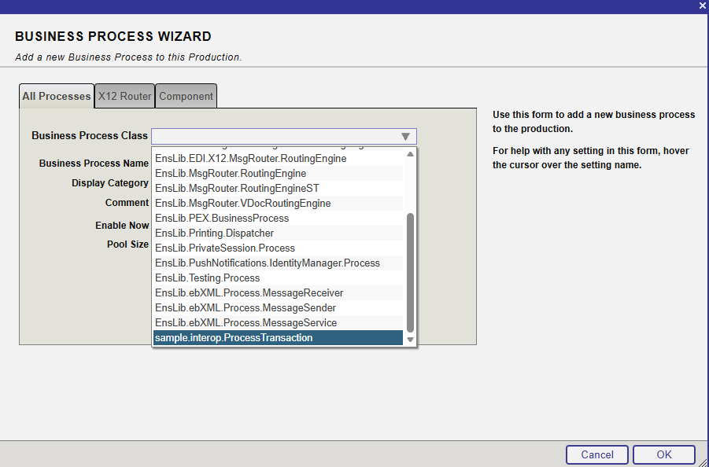

# Interoperability

Interoperability is the ability for systems and devices to seamlessly interact, work together and exchange information across different platforms and standards. 

An example of an interoperability system is an automated loan application checking service. A user submits an application, leading to automated queries to different loan providers to check what loan they could provide. Finally the interoperable system might provide a response to the user in the form of sending an email. At several points in this system, there may be rules-based processes, e.g. to check the outcome of a loan request before writing an acceptance or denial email. 

In InterSystems IRIS, an interoperable system, or production, is completed by three main process types: 

- Business Services
    - Responsible for recieving incoming signals.
    - Loan example: the Business Service would recieve the data from the submitted form.

- Business Processes
    - Responsible for conditional routing of messages, as well as required transformations of data. 
    - Loan example: Processes would send the required data to operations to check different loan providers, and apply conditional logic to call acceptance or rejection email operations.

- Business Operations
    - Responsible for Downstream processes, this may include intermediate processes like querying a database before the final outputs.
    - Loan example: Responsible for querying loan providers and sending decision email.

There are two other crutial components: 

- Adapters 
    - These are connectors that help read input data (inbound adaptors) or create output data in a suitable format (outbound adaptors).
    - Loan example: A JSON adapter may read data that has been submitted via POST request to a REST endpoint. 

- Messages
    - These contain the information being passed between the different components. 

(Placeholder image)



Adapters - [Wide range of adapters available but also possible to create their own](https://docs.intersystems.com/irislatest/csp/docbook/DocBook.UI.Page.cls?KEY=EGIN_options_connectivity).


# Creating a simple Interoperability Production


This guide walks through the creation of a simple code-first interoperability production to show how these productions can be built. 


## Design Brief:

The aim of this walkthrough is to design a system to process transactions. This system will be very simple, but will guide the process of building a simple interoperability production with InterSystems IRIS. The process is as follows: 

1. A transaction is initialized by a csv file with the order details being added to the Transactions folder.
2. Business service reads the transaction data (via an Inbound adapter) and sends a request to a Business Process
3. The Business process sends a request to a Business Operation to update stock. 
4. The Business Operation sends a response with the updated stock values.
5. The Business Process checks if any of the updated stock values are less than 5, if so, sends a low-stock warning email.


Interoperability productions are built from classes, as is standard within InterSystems IRIS. Each component is generally a separate class, unless there are multiple components w
To build this production, we need the following components: 

1. FromCSV Business Service
2. Transaction Routing Business Process
3. Stock updating Business Operation
4. Low-Stock email Business Operation

And the following messages: 

1. Transaction Request. This can be reused between the business service and the business process, and between the business process and the stock updating business operation.
2. Updated stock response.

The transaction data is going to have the following: 

|ProductID|ProductName|Quantity|
|-|-|-|
|P123|Keyboard| 1|
|P132|Montor| 2|


Each of these classes are going to be individually defined below, together with some details on the process behind their design. For the full coded example, see [final github link](). Alternative examples can be found at: [loan demo link](), [Reddit demo link]().


## Transaction Request Message

Messages are often a good place to begin when coding an interopability production. 

Messages are generally stored in tables to allow them to be tracked and searched. For this reason, messsages should extend the `%Persistent` superclass to allow it to be saved to a database, as well as the `Ens.Request` or `Ens.Response` superclasses. 

Messages are also recommended to extend `%XML.Adatper` as this allows the messages to be viewed in the management portal.

We are going to simply create a message that has the columns within the original transaction CSV, as well as an additional value for Order ID, so the messages can be grouped by order ID in future.

Note, we are making a design choice to send a single message for each row of the CSV file. This design makes sense as we can update the stock for each item in the transaction individually. In other systems however, it may make sense to include all the data in the original file as a single message. 

```
Class sample.interop.TransactionMessage Extends (%Persistent, %Ens.Request, %XML.Adapter)
{
    Property OrderId As %Integer;

    Property DateTime As %Date

    Property ProductId As %Integer;

    Property ProductName As %String; 
    
    Property Quantity As %Integer;
}
```


We will also define a response message to return information on the current stock level from the business Operation. 

```
Class sample.interop.StockMessage Extends ( %Persistent, %Ens.Response, %XML.Adapter)
{
    Property ProductID As %Integer;

    Property ProductName As %Integer; 

    Property CurrentStock As %Integer;
}
```

## Business Service

The business service is the process which populates the transaction request message we have created. To do this, an **Inbound Adapter** is required. The adapter recieves the data coming into the production. Inbound adapters could recieve data from one of the following examples: 

- Reading a file 
- REST Request
- Email 

There are a wide number of inbound adapters availble, but its also possible to create custom adaptors using the Ens.InboundAdapter superclass. 

The service class should extend the superclass `Ens.BusinessService` 


```
Class sample.interop.CsvFileService Extends Ens.BusinessService{

Parameter ADAPTER = "Ens.File.InboundAdapter"

Method OnProcessInput(pInput As %FileCharacterStrema, Output pOutput As %RegisteredObject) As %Status
{
    do ..Adapter.WorkPathSet("NewTransactions")
    do ..Adapter.ArchivePathSet("ProcessedTransactions")

    // Increment the Order ID
    set OrderId = $Increment(^OrderCounter)
    
    // Read the headers line of the csv file
    set headers = pInput.ReadLine()


    while 'pInput.AtEnd{
        set line = pInput.ReadLine()

        // Create a new message for each transaction line
        set msg = ##class(sample.interop.TransactionMessage)
        
        // Set the Order ID as the transaction order ID
        set msg.OrderId = OrderId
        
        // Add the processing date and time in ODBC format
        set msg.DateTime = $ZDATETIME($HOROLOG, 3)

        // Set the values from the line of the csv file
        set msg.ProductId = $Piece(line, ",", 1)
        set msg.ProductName = $Piece(line, ",",2)
        set msg.Quantity = $Piece(line, ",", 3) 

        // Send Asynchronous request
        set st=..SendRequestAsync(
           "sample.interop.TransactionRouter", req)
        if 'st $$$LOGERROR("Cannot call PrcMain Process for ProductID "_$Piece(line, ",", 1))
    }

}
}
```


## Business Operations

Business Operations perform the downstream functions that result from incoming messages. They do not need to be endpoints, as they can pass information back to the business host that called them, generally a business process. Business Operations can therefore be called to supply additional information to a business process by querying a database. In this example, we are going to implement two business operations, updating the item stock databases, and sending low-stock warning. 

The Updating Stock operation therefore has two way information flow, as the result of this operation is returned to the business process. The low-stock warning operation has a single direction inforamtion flow, as information does not need to be sent back to the business process. 

A Business Operation requires a message map, this is an XML specification which defines what method is called depending on the type of message calling the operation. In this way, a business operation class could have different functionality in response to different incoming messages.  


### Updating Stock


```
Class sample.interop.ToUpdateStockDB Extends Ens.BusinessOperation{

    XData MessageMap
    {
    <MapItems>
        <MapItem MessageType="sample.interop.TransactionMessage">
            <Method>
                UpdateDatabase
            </Method>
        </MapItem>
    </MapItems>
    }
    
    Method UpdateDatabase(pReq As sample.interop.TransactionMessage, Output pResp As sample.interop.StockMessage) As %Status
    {
        // Open the stock item in the database
        set stockItem = ##class(sample.StockTable).%OpenId(pReq.ProductId)

        // Update the current stock
        set stockItem.CurrentStock = stockItem.CurrentStock - pReq.quantity
        
        // Update the last sale date
        set stockItem.LastSale = pReq.Datetime
        
        // Save the edited item
        set stockItem.%Save()

        // Create and populate the response message
        set pResp = ##class(sample.interop.StockMessage).%New()

        set pResp.CurrentStock = stockItem.CurrentStock
        set pResp.ProductId = pReq.ProductId
        set pResp.ProductName = pReq.ProductName

        quit $$$OK
    }

}
```

### Mail Operation

```
Class sample.interop.ToEmail Extends Ens.BusinessOperation
{
    Parameter ADAPTER + "EnsLib.EMail.OutboundAdapter"

    XData MessageMap
    {
    <MapItems>
        <MapItem MessageType="sample.interop.TransactionMessage">
            <Method>
                SendEmail
            </Method>
        </MapItem>
    </MapItems>    
    }

    Method SendEmail(pReq As sample.interop.TransactionMessage, Output pResp as Ens.Response) As %Status
    {
        set email = ##class(%New.MailMessage).%New()
        
        set emailText = "Warning! Stock for "_pReq.ProductName_" (ProductID: "_pReq.ProductId_") Is running low. Currently, there are only "_pReq.Quantity_" Units left in stock.

        do email.TextData.Write(emailText)

        set emailSubject = "Stock Warning PID: "_pReq.ProductId
        set email.subject(emailSubject)

        set tSc ..Adapter.SendMail(email)

        if '$$$ISOK(tSc) $$$LOGERROR("Email Send Fail")
        
        quit tSc
        }

}
```

## Business Process

Now we have the functions at either end of the production, the next to do is connect them using a conditional routing process. The rules behind the message routing are simple. When a message arrives, the `ToUpdateStockDB` operation needs to be called synchronously to recieve the output of the new stock number. If the resulting stock is low, in this example we shall put a limit of 5 units, the business process sends an additional call to `ToEmail`. 

The easiest way to create business processes is using Business Process Langauge, which defines rules in XML data, but can be easily built using the graphical user interface (GUI) in the management portal.


```xml
Class sample.interop.ProcessTransactionRouterRules Extends Ens.Rule.Definition
{
    Parameter RuleAssistClass = "EnsLib.MsgRouter.RuleAssist"

    XData RuleDefinition [ XMLNamespace = "http://www.intersystems.com/rule ]
    {
    <ruleDefinition alias="" context="EnsLib.MsgRouter.RoutingEngine" production="sample.interop.Production">
    <ruleSet name="" effectiveBegin="" effectiveEnd="">
    <rule name="">
    <constraint name="msgClass" value="sample.interop.TransactionMessage"></constraint>
    <call name="CallUpdateStockDB" target="sample.interop.ToUpdateStockDB" async=0>
        <request type="sample.interop.TransactionMessage">
            <assign property="callrequest.ProductId" value="request.ProductId" action="set" />
            <assign property="callrequest.ProductName" value="request.ProductName" action="set" />
            <assign property="callrequest.Datetime" value="request.Datetime" action="set" />
            <assign property="callrequest.Quantity" value="request.ProductQuantity" action="set" />
        </request>
        <response type="sample.interop.StockMessage">
            <assign property="context.Stock" value="callresponse.CurrentStock" action="set" />
            <assign property="context.ProductId" value="callresponse.ProductId" action="set"/>
            <assign property="context.ProductName" value="callresponse.ProductName" action="set"/>
        </response>
    </call>

    <if condition="context.Stock &lt; 5">
        <true>
            <call name="CallToEmail" type="sample.interop.ToEmail">
                <request type="sample.interop.TransactionMessage">
                    <assign property="callrequest.ProductID" value="context.ProductId" action="set"/>
                    <assign property="callrequest.ProductName" value="context.ProductName" action="set"/>
                    <assign property="callrequest.Quantity" value="context.Stock" action="set"/>
                </request>
            </call>
        </true>
    </if>
    <return></return>
    </rule>
    </ruleSet>
    </ruleDefinition>
    }
}
```

## Creating the StockQuantity database

To create the stock quantity database, we can use a perisistent class. To keep it simple, we only need the ProductId,  ProductName, Quantity in stock, and date last sold. To make it easier to populate the table, we will also add a class method which creates a new object and saves it to the table. 

```
Class sample.StockTable Extends %Persistent
{
Property ProductId As %Integer [ Required ];

Property ProductName As %String;

Property Quantity As %Integer [ Required ];

Property DateLastSold As %Date;

ClassMethod CreateNew(pid As %Integer, pName As %String, quantity As %Integer) As %Status
{
        set newItem = ##class(sample.StockTable).%New()
        set newItem.ProductId = pid
        set newItem.ProductName = pName
        set newItem.Quantity = quantity
        set sc = newItem.%Save()
}

}

```

### Populating table 

Now we have saved the above class, we can populate the table by running the following in the IRIS command line (ensure it is in the USER namespace): 

```
do ##class(sample.StockTable).CreateNew(101, "Computer Mouse", 17)
do ##class(sample.StockTable).CreateNew(102, "Monitor", 13)
do ##class(sample.StockTable).CreateNew(103, "Laptop", 7)
do ##class(sample.StockTable).CreateNew(104, "Desktop PC", 11)
do ##class(sample.StockTable).CreateNew(105, "Keyboard", 11)
```

Now, we can open the SQL Editor at [http://localhost:52773/csp/sys/exp/%25CSP.UI.Portal.SQL.Home.zen?$NAMESPACE=USER](http://localhost:52773/csp/sys/exp/%25CSP.UI.Portal.SQL.Home.zen?$NAMESPACE=USER) and view the table with:

```
SELECT 
ID, DateLastSold, ProductId, ProductName, Quantity
FROM sample.StockTable
```
and, all being well, the following table should exist: 

|  ID  | DateLastSold | ProductId | ProductName    | Quantity |
|------|--------------|-----------|----------------|----------|
| 101  |              | 101       | Computer Mouse | 17       |
| 102  |              | 102       | Monitor        | 13       |
| 103  |              | 103       | Macbook        | 7        |
| 104  |              | 104       | Desktop PC     | 11       |
| 105  |              | 105       | Keyboard       | 11       |


## Creating the Production






[naming conventions](https://docs.intersystems.com/iris20252/csp/docbook/DocBook.UI.Page.cls?KEY=EGBP_routing_best_practices#EGBP_naming_conventions)