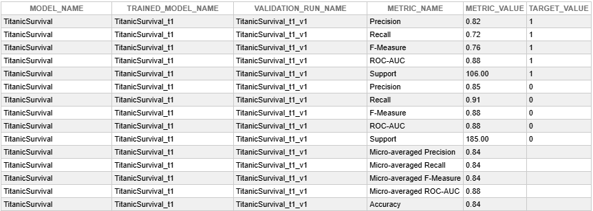
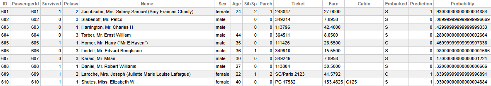
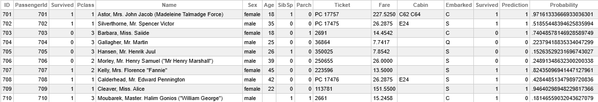

# Integrated Machine Learning Quickstart

InterSystems IRIS has support for a highly automated machine learning process which is accessible with a few simple SQL commands. While the results from these automated models may not be as accurate as models carefully created by data scientists, they are generally robust and require no expertise to implement. 

This quickstart will go through how you can start using IRIS's Integrated Machine Learning tools from scratch to create actionable insights. 

## Download IRIS 

If you haven't already, you can download InterSystems IRIS Community Edition (or InterSystems IRIS for Health Community Edition) from docker, or use an existing install. 
```bash
docker run --name iris-community --publish 52773:52773 --publish 1972:1972 -d intersystems/iris-community:latest-em
```

## Install the AutoML requirement with pip 

Open a bash shell in your docker container: 

```bash
docker exec -it iris-community bash
```
and run the following command: 

```bash
python3 -m pip install --index-url https://registry.intersystems.com/pypi/simple --no-cache-dir --target /usr/irissys/mgr/python intersystems-iris-automl
```

The install `--target` will vary by install method. The target given above is true for an InterSystems IRIS Community image in a docker container, but may need to be altered for other install methods. The general target is `/<IRIS-INSTALL-LOCATION>/mgr/ptyhon`. 

# Predicting Survival on the Titanic

This quickstart uses the [Titanic survival dataset](https://www.kaggle.com/datasets/heptapod/titanic). If you have experience with machine learning you will likely be familiar with this, if not, it is a dataset containing information on the passengers on the titanic, including class of cabin, gender, age and price of ticket. This information can be used to make an informed prediction on whether each individual passenger died or survived the disaster.

If you would rather use your own dataset, feel free to skip the install below and load your data with one of the many methods available.

## Install the dataset

This dataset has been packaged with the InterSystems Package Manager (IPM), so it can be downloaded from the IRIS command line. You can open an IRIS terminal from VS Code, or from the regular terminal with: 

```bash
docker exec -it iris-community iris session iris
```

Then install the package manager with the following command in the IRIS terminal:

```
set $NAMESPACE="USER"

s version="latest" s r=##class(%Net.HttpRequest).%New(),r.Server="pm.community.intersystems.com",r.SSLConfiguration="ISC.FeatureTracker.SSL.Config" d r.Get("/packages/zpm/"_version_"/installer"),$system.OBJ.LoadStream(r.HttpResponse.Data,"c")
```

This will install `zpm`, the command to use the InterSystems package manager. To start, run:

```
zpm
```
Then connect to the developer community package repository: 

```
repo -r -n registry -url https://pm.community.intersystems.com/ -user "" -pass ""
```

And download the dataset with: 

```
install dataset-titanic
```

## Test/Train Split

**From this point the rest of the tutorial is performed in SQL, this can be run from the Management Portal SQL Editor at: http://localhost:52773/csp/sys/exp/%25CSP.UI.Portal.SQL.Home.zen?$NAMESPACE=USER** 

**However, the SQL can also be performed from any other SQL client, including SQLTools, DBeaver, Python DB-API, ObjectScript etc.**


When creating a machine learning model, it is important to validate the predictions against data where you already know the result. Crutially, this test data cannot be present in the original training dataset, because otherwise it would not be a reliable test. Therefore the first step when creating a machine learning model, is splitting the data you are using into **training data** and **testing data**. 

The proportion of the data split is a parameter that can be optimised, as more training data will create a better informed model, but more testing data will create more robust validation. In general, a good place to start is using approximately 70-80% percent of your data to train the model and 20-30% to test it. 

In our titanic dataset, there are 892 passenger records, so we will take the top 700 records as the testing dataset (78%) and rest as the testing set. Here we create `VIEWS`, which are virtual tables that can be treated like a standard table, but do not duplicate the data.

```sql
CREATE VIEW dc_data.TitanicTrain AS
SELECT * 
FROM dc_data.Titanic
WHERE id < 700
```

```sql
CREATE VIEW dc_data.TitanicTest AS
SELECT *
FROM dc_data.Titanic
WHERE id > 700
```

### Create the model

Creating a model simply requires as giving a model name, the column to predict and the training data table:

```sql 
CREATE MODEL TitanicSurvival PREDICTING (Survived) FROM dc_data.TitanicTrain
```

It is possible to define which columns to use for the prediction using the WITH keyword, this is not required as the AutoML model will automatically find and use the relevant columns. If you do define the columns used, you do also need to 

```sql
CREATE MODEL TitanicSurvivalWithSexAgeFare PREDICTING (Survived) WITH (Sex varchar, Age integer, Fare numeric) FROM dc_data.TitanicTrain
```

### Train the model
Model training is done with `TRAIN MODEL <modelname>`: 

```sql
TRAIN MODEL TitanicSurvival
```
or 
```
TRAIN MODEL TitanicSurvivalWithSexAgeFare
```
Model training will take a while for large datasets, but should only take a few seconds for this size of dataset. 

## Validate model
After training, we can see how the model performed by validating it against the test set. This command runs validation, and outputs the metrics to the table `INFORMATION_SCHEMA.ML_VALIDATION_METRICS` 

```sql
VALIDATE MODEL TitanicSurvival FROM dc_data.TitanicTest
```

After performing the validation, we can view the metrics by running: 

```sql 
SELECT * FROM INFORMATION_SCHEMA.ML_VALIDATION_METRICS
```
Theres a number of metrics that can measure performance in different ways, for example comparing the number of false positives vs false negatives. 



If you are interested in what all these metrics are, they are explained in the [documentation](https://docs.intersystems.com/irislatest/csp/docbook/DocBook.UI.Page.cls?KEY=RSQL_validatemodel#RSQL_validatemodel_Metrics). The simplest validation metric is accuracy - this is simply the proportion of correctly classified results.

This model has an accuracy of 81%, which is pretty good, especially for how simply the model was created. There is random variability here, so model statistics may differ between runs (unless a seed value is set).

## Using the model
The model can be used to predict values in a table with the same schema. It can also output a probability, which can give a confidence level for the prediction. These can be done with the `PREDICT(<modelname>)` and `PROBABILITY(<modelname>)` functions. 

## Predict
To predict the output of the target column, run:
```sql
SELECT *,Survived, PREDICT(TitanicSurvival) As SurvivalPrediction FROM dc_data.TitanicTest
```
This will create a new column called SurvivalPrediction, containing the prediction. Survived has been added to the table twice to make comparison easier.



It's also possible to use the results of the prediction to filter the output.
```sql
SELECT * FROM dc_data.TitanicTest WHERE PREDICT(TitanicSurvival)=1
```

## Probability 

The model can also output a probability value for the prediction using the `PROBABILITY(<modelname>)` function
```
SELECT *,Survived, PREDICT(TitanicSurvival) AS Prediction, PROBABILITY(TitanicSurvival) As Probability FROM dc_data.TitanicTest
```



This output shows that some the incorrect results had low confidence in the original prediction - for example Passenger 708, Edward Calderhead, was predicted to have a 43% likelihood of survival, and did survive. 
# Regression

The above example was a binary classification, classifying each datapoint into one of two categories - survived or didn't survive. It is also possible to perform regression, which is predicting a continuous value. Performing a regression is just as easy, you just need to chose a continuous numeric column as the column being predicted. 

Below is an example predicting the price each passenger paid for their ticket in just 3 commands. 

```
CREATE MODEL FarePrediction PREDICTING (Fare) FROM dc_data.TitanicTrain 
```
```
TRAIN MODEL FarePrediction
```
```
SELECT TOP 10 PassengerId, Fare, PREDICT(FarePrediction) AS PredictedFare FROM dc_data.TitanicTest
```

| PassengerId | Fare     | PredictedFare |
|-------------|----------|--------------|
| 701         | 227.5250 | 95.19         |
| 702         | 26.2875  | 64.96          |
| 703         | 14.4542  | 11.32          |
| 704         | 7.7417   | 6.75           |
| 705         | 7.8542   | 14.81          |
| 706         | 26.0000  | 48.99          |
| 707         | 13.5000  | 13.54          |
| 708         | 26.2875  | 34.43          |
| 709         | 151.5500 | 111.26         |
| 710         | 15.2458  | 17.18          |


It is still worth running the model validation in the same way as shown for the classification example. Here, the validation gave a Root Mean Squared Error of 43.90, and a R^2 value of 0.35. This that 70% of the variance in the data is accounted for by the model, which is pretty good. 

The RMSE is high, this is the average difference betwen the predicted values and the actual values. This is a much bigger difference than can be seen in the output above, which may mean we have some major outliers. We can look at outliers by ordering the data by the magnitude of difference between the fare and predicted fare:

```sql
SELECT TOP 10 PassengerId, Fare, PREDICT(FarePrediction) AS PredictedFare 
FROM dc_data.TitanicTest 
ORDER BY ABS(Fare - PREDICT(FarePrediction)) Desc
```

| PassengerId | Fare     | PredictedFare |
|-------------|----------|--------------|
| 738         | 512.3292  | 25.52      |
| 731         | 211.3375  | 64.16      |
| 780         | 211.3375  | 76.87      |
| 701         | 227.5250  | 95.19      |
| 888         | 30.0000   | 130.55     |
| 843         | 31.0000   | 123.85     |
| 717         | 227.5250  | 143.06     |
| 857         | 164.8667  | 84.26      |
| 743         | 262.3750  | 190.93     |
| 854         | 39.4000   | 103.76     |


So As predicted, there are some very big outliers which skew the RMSE validation statistic. But despite this, we can still see the value if we run the command again but this time in ascending order (remove `Desc` at the end):

| PassengerId | Fare     | PredictedFare |
|-------------|----------|--------------|
| 707         | 13.5000  | 13.54      |
| 817         | 7.9250   | 8.00       |
| 876         | 7.2250   | 7.32       |
| 762         | 7.1250   | 7.01       |
| 889         | 23.4500  | 23.31      |
| 806         | 7.7750   | 7.62       |
| 808         | 7.7750   | 7.61       |
| 776         | 7.7500   | 7.58       |
| 765         | 7.7750   | 7.58       |
| 786         | 7.2500   | 7.03       |


### Other Features
There are several features of Integrated ML that are beyond the scope of this guide, but can be found within the [documentation](https://docs.intersystems.com/irislatest/csp/docbook/DocBook.UI.Page.cls?KEY=GIML_Basics): 

- Time series model prediction
- Integration with ML-as-a-Service providers H2O and DataRobot.
- Mapping names of columns for datasets with different headers.
- Predicting probability for each class in a multi-class classification

You can also read more about how the [AutoML engine works](https://docs.intersystems.com/irislatest/csp/docbook/DocBook.UI.Page.cls?KEY=GAUTOML_Intro).

