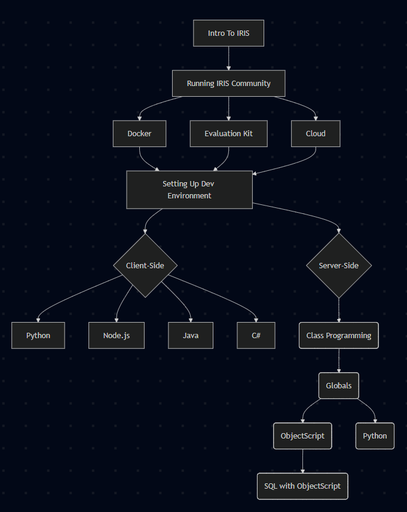
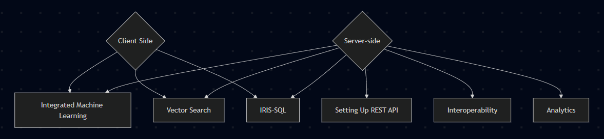

# Quickstarts WIP 

Currently have first drafts of:

- [Running IRIS community on docker / on the cloud](GettingStartedWithIRISCommunity/GettingStartedWithIRISCommunity.md).
- [Setting Up Development environment (VS Code)](DevelopmentEnvironment/DevelopmentEnvironmentSet-up.md)
- [Server-side coding (ObjectScript/Classes/Embedded Python)](ServerSideCoding/GettingStartedWithServer-sideCoding.md)
- [External Python](ExternalPython/ExternalPythonQuickstart.md)
- [REST](REST-Quickstart/REST-V2.md)
- [Vector Search](VectorSearch/VectorSearch.md)
- [Creating a FHIR Server ](FHIRServer/CreateAFHIRSeverIn5Minutes.md) 
    - This might benefit from another related page on using the FHIR server
    - I already have a guide to using the FHIR SQL builder from the hackathon kit, maybe I should convert this into something. 
- [Integrated ML](ML/integratedML.md) 
- [Calling SQL Statements](SQL/CallingSQLStatements.md)
- [InterSystems-SQL language features](SQL/InterSystems-SQL-Langauge-Features.md)
- **Interoperability**
    - Having created the simplest example I could think of, I've concluded that a "quickstart" guide might not be so quick.
    - I've split this into 6 guides which are designed to work through the entire process start to finish. I wanted to make it shorter but I think it already has close to the bare minimum information required. I've split it into 
        - [Interoperability introduction](Interoperability/1-interoperability.md)
        - [Message](Interoperability/2-Messages.md)
        - [Business Operations](Interoperability/3-BusinessOperations.md)
        - [Business Process](Interoperability/4-BusinessProcess.md)
        - [Business Service](Interoperability/5-BusinessService.md)        
        - [Using the Production](Interoperability/6-UsingTheProduction.md) 
    - I picture these being a sequence of pages or tabs on the same page.

By Irene: 
- Java
- C#

WIP: 
- node.js

waiting on: 
- Analytics

## Learning Flow: 

### Basic: 

### Advanced: 

