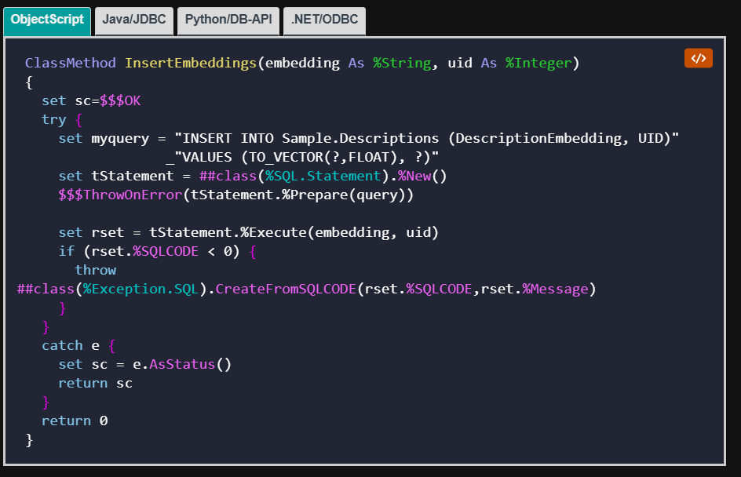

# Quickstarts WIP 

Currently have first drafts of:

- [Server-side coding (ObjectScript/Classes/Embedded Python)](ServerSideCoding/Getting%20started%20with%20server-side%20coding.md)
- [External Python](ExternalPython/External%20Python%20Quickstart.md)
- [REST](REST-Quickstart/REST%20Quickstart.md)
- [Setting Up Development environment (VS Code)](DevelopmentEnvironment/Development%20Environment%20Set-up.md)
- [Vector Search](VectorSearch/VectorSearch.md)
- [Creating a FHIR Server ](FHIRServer/CreateAFHIRSeverIn5Minutes.md) 
    - This might benefit from another related page on using the FHIR server
- [Integrated ML](ML/integratedML.md) 
- [Calling SQL Statements](SQL/CallingSQLStatements.md)
- [InterSystems-SQL language features](SQL/InterSystems-SQL-Langauge-Features.md)
- [Running IRIS community on docker / on the cloud](GettingStartedWithIRISCommunity/GettingStartedWithIRISCommunity.md).

WIP:
- [Interoperability](Interoperability/interoperability.md)
    - Having created the simplest example I could think of, I've concluded that a "quickstart" guide might not be so quick.
    - Currently working to split up the Interoperability quickstart into:
        - Business Service
        - Business Operations
        - Business Process
        - Messages 
        - Tracking Messages, Testing and Debugging? 
    - I picture these being some kind of sequence of pages or maybe different tabs of the same page? 

Below is the suggested list of quickstarts still to be written: 

By me: 
- node.js
- Web development / csp? 

By Others:
- Java
- .NET
- Analytics

As an aside, this is a nice feature of the vector search documentation page: 

