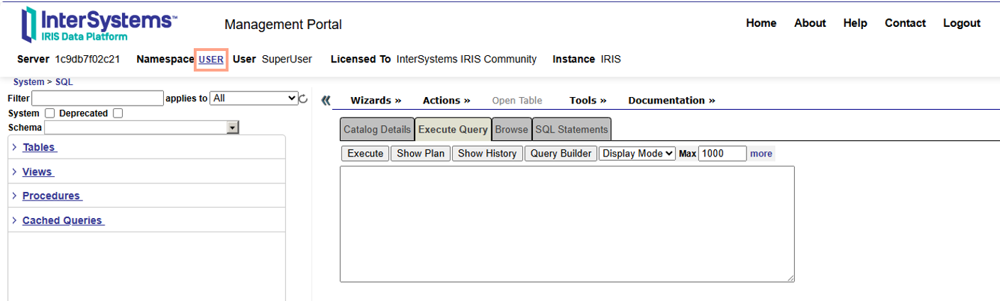

# Calling SQL Statements

Structured Query Language, or SQL is used to interact with InterSystems Database through a relational model, that is treating the values stored in globals as data tables. You can call SQL statements from many different places, allowing the flexibility to use the data in a relational format, whatever your application or use case.

## Management Portal SQL Editor
The easiest way to use SQL with your dataset is within the Management Portal at http://localhost:52773/csp/sys/exp/%25CSP.UI.Portal.SQL.Home.zen (remember to change the server and port to match your IRIS instance).  To find the SQL Editor from the homepage, select `System Explorer` from the left-hand panel, then select `SQL` and click `GO`. 

You can change the namespace from the link at the top of the page (Orange box in image below).  



To run a SQ+L Statement, type the statement into the editor box and click `Execute` or press `Ctrl-Enter`. 

There are far too many features within the management portal to them all, so to find out more, its recommended to look at the [relevant page of the documentation](https://docs.intersystems.com/irislatest/csp/docbook/DocBook.UI.Page.cls?KEY=GSQL_smp). Some useful features for beginners: 
  - You can navigate the tables in your namespace with the panel on the right-hand side.
  
  - Click and drag any table from this list to the command box, to automatically generate a query to select all the data from the table.
  


  - Create Select Queries using a graphical user interface with the `Query Builder` button.

  - See the previous commands run by clicking `Show History` - from here you can find your previous queries, and execute them directly. 

## Terminal

You can start a SQL terminal shell from an IRIS terminal with: 

```
do ##class(%SYS.SQL).Shell()
```
or as a shortcut:
```
:sql
```
From here, you can run SQL statements and queries. 

```
USER>:sql
SQL Command Line Shell
----------------------------------------------------

The command prefix is currently set to: <<nothing>>.
Enter <command>, 'q' to quit, '?' for help.
[SQL]USER>>SELECT * FROM NAME
```

To return to the IRIS terminal, simply run `quit`.

## Using SQL in ObjectScript

### Embedded SQL
You can run SQL queries and transactions using objectscript in several ways. The simplest is Embedded SQL, this is only suitable for simple queries:

```
&sql(SELECT Name INTO :n FROM Sample.Person)
write "name is: ", n
```

### Dynamic SQL:

If you need to create a query at runtime which involves a variable, you might be best using dynamic SQL. A basic example of this is shown below: 

```

ClassMethod BasicDynamicSQL(numOutput as %Integer, minAge as %Integer) As %Status{
  
  // Create SQL Query as string. Replace variables with ?
  set myquery = "SELECT TOP ? Name,DOB FROM Sample.Person WHERE Age < ?"
 
  // Create %SQL.Statement object  
  set tStatement = ##class(%SQL.Statement).%New()
 
  // Prepare Query
  set qStatus = tStatement.%Prepare(myquery)
  
  // If query preparation fails, write error 
  if qStatus'=1 {
	   write "%Prepare failed:" 
	   do $System.Status.DisplayError(qStatus) 
	   quit
   }
  // Execute the query, passing in parameters for placeholder ?
  set rset = tStatement.%Execute(numOutput, minAge)
  
  do rset.%Display()
  
  write !,"End of data" 
}
```
It is important to use ? placeholders and the Statement.%Prepare() function for security in preventing SQL injection. 


### Using a Query component

You can use a query component within an IRIS class to run a query:

```sql
Class packagename.SQLQuery Extends %RegisteredObject
{
  Query ByName (pStartsWith As %String) As %SQLQuery [ sqlProc ] 
  {
      SELECT ID, NAME,
      FROM sample.Patient
      WHERE (Name %STARTSWITH @pStartsWith)
  }
  ClassMethod UseQueryByName(name As %String){
      Set statement = ##class(%SQL.Statement).%New()
      Set status = statement.%PrepareClassQuery("Sample.Patient", "ByName")
      If $$$ISERR(Status){
        Do $system.OBJ.DisplayError(status)
      }
      
      Set rs = Statement.%Execute(name)
      
      While rs.%Next(){
        print(rs.get("ID"), rs.get("NAME"))
      }
      Do rs.%Close()
  }
}
```

This method of running a SQL query in ObjectScript can be effective for creating complex queries.


### Run SQL file

If you have a file containing SQL commands, you can run it from ObjectScript with the following command: 

```
  DO $SYSTEM.SQL.Schema.ImportDDL("c:\InterSystems\mysqlcode.txt",,"IRIS")
```

## SQL in Embedded Python 

You can use SQL in Embedded Python using `iris.sql`.

Embedded SQL: 
```python
import iris
rs = iris.sql.exec("SELECT Name FROM packagename.Person")
```

Dynamic SQL: 
``` python
import iris
# Use ? as a placeholder
stmt = iris.sql.prepare("SELECT Name, Age FROM packagename.Person WHERE Age > ?" )

# pass in argument(s) for placeholder
age = 25
rs = stmt.execute(age)
```

This will return a Python list of lists, you can iterate as follows: 

```python
for row in rs: 
	 print(row)
	 
- ["John Smith", 30]
- ["Jane Doe",31 ]
```


## External Connections

You can connect to IRIS databases using SQL from a number of external applications. 

There are standard drivers for Java Database Connectivity (JDBC) and Open Database Connectivity (ODBC). These drivers can be used for connections from a range of languages, which are covered separately on the [External Languages page](Link needed!), and many applications that support these connection types, including the database explorer DBeaver, analytics tools like PowerBI and Tableau, ETL or integration platforms such as Talend and Informatica.


### JDBC 
JDBC is a database connection standard that is used within Java applications. To connect to IRIS using JDBC, use the following syntax to create a URL. 

```
jdbc:IRIS://<host>:<port>/<namespace>
```
- _Host_ is the Server location, if running locally this is `localhost` or `127.0.0.1`
- _port_ is the TCP port number for binary connections, the default is `1972`
- _Namespace_ is the namespace containing the data tables.

A basic example of a connection string to a locally running IRIS instance is:
```
jdbc:IRIS://localhost:1972/USER
```
#### DBeaver

Connections to IRIS is natively supported within the database client application [DBeaver](https://openexchange.intersystems.com/package/DBeaver). The connection can be done with the JDBC connection string above. For more information, see [DBeaver officially supports InterSystems IRIS](https://community.intersystems.com/post/dbeaver-officially-supports-intersystems-iris).

### ODBC

InterSystems supports connections with ODBC. The nature of these connections depends on the operating system and environment you are using it from, so for full details on installation and set-up, see the [relevant documentation pages](https://docs.intersystems.com/irislatest/csp/docbook/DocBook.UI.Page.cls?KEY=BNETODBC_intro). 

Setting up an ODBC connection as a data-source allows you to use the data directly in applications on your system, including using it directly within Excel. 

There are also open source libraries for connection to ODBC using Node.JS and other external languages, allowing for relational table access from JavaScript. 

### Python DB-API 

There is a specific driver for database connections with python, this is covered in detail on the [External Languages - Python](Add link!) page. 