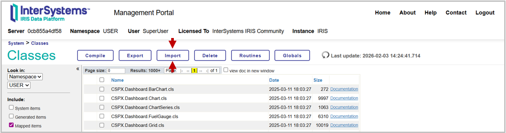
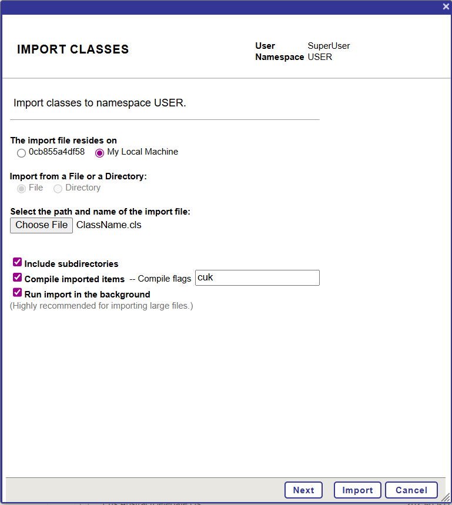

## Introduction to Classes

The code used in InterSystems IRIS is organized in classes. A class defines a structure for data and behavior, combining stored data with methods that implement behavior. Almost every aspect of InterSystems IRIS development relies on classes, including storing data in databases, manipulating objects, interopability components and internal configuration.

IRIS class definitions are stored in files with the .cls extension and written using ObjectScript (with optional embedded SQL, Python and XML blocks). Once defined, a class can be compiled into the IRIS environment, making it available as an object, as a persistent table, or as part of a larger application.

This guide introduces fundamental elements of IRIS classes, then demonstrates their use through practical and worked examples.
### Components

Classes have components, such as properties, parameters, methods and class methods.

The following is a list of the most common class components with a brief explanation, many of these features will be demonstrated in the example class below:

- Parameter: Constant values, set within a class definition.
- Property: Variable which can be set in class objects.
- ClassMethod: A method (function) which does not require a class object to be run.
- Method: A method that can only be run from an instantiated class object.
- Query: A pre-written SQL query.
- XData: Data block, primarily consisting of XML data, but could also be other formats like JSON or YAML. Used for specific purposes like mapping REST API endpoints to methods. 

### Inheritance

Classes can inherit from superclasses. Superclasses will provide classes with methods and class methods which are important or specialised for a specific use, for example the `%JSON.Adaptor` gives ability to import or export JSON strings. There are superclasses for different components in an interoperability production, or for REST handlers. 

The most important superclasses to be aware of are `%RegisteredObject`, and its child class `%Persistent`. 

`%RegisteredObject` allows the class to be instantiated into an object, which can be used to store values as properties and run `Methods`. Only classes which inherit from `%RegisteredObject` or a sub-class of `%RegisteredObject` (including `%Persistent` and `%SerialObject`) can be instantiated into an object.

`%Persistent` classes are classes which can be saved into the database, providing persistent storage and SQL projection (more on this below).

## Setup

### Run IRIS

To maximise your learning in when going through this guide, it is suggested to have an example instance of InterSystems IRIS running. The easiest method to do this is to use use InterSystems IRIS Community Edition in a docker container. The command below will start a container, or for more information, see [run in docker]().

```sh
docker run --name my-iris --publish 1972:1972 --publish 52773:52773 -d intersystems/iris-community:latest-em
```

### Compiling Classes

Classes need to be imported into the InterSystems IRIS instance and compiled before usage, which can be done in a variety of ways.

#### IDE (VS Code)

The primary method to import and compile classes is from VS Code, the recommended IDE. With the ObjectScript extensions pack, files can be directly created on the InterSystems IRIS server, or imported and compiled automatically upon saving. See [Set up your Development Environment in VS Code]() for a full explanation of how to do this. Compiling directly from the IDE is the most convenient way for active development. 


#### Management Portal

The Management Portal can also be used to import classes directly. This method is less convenient for continuous editing, but can be effective for quickly adding files into your instance (like the example classes below). 

To import from the management portal, save the class as a file locally, then open the management portal (http://localhost:52773/csp/sys/%25CSP.Portal.Home.zen if running locally with the default port), and navigate to **System Explorer -> Classes -> Go**.



This will bring up a page of all the compiled classes on your instance. Ensure you are in the USER namespace, then click `Import` at the top of the page to bring up the class importer wizard. Then you can choose to upload a file on your system, select your file from the browser pop-up. The default settings will be fine for a basic import and compile, so you just need to select a file and click `Import`



There are more settings to explore here like importing files local to the instance and adding [compiler flags](https://docs.intersystems.com/irislatest/csp/docbook/DocBook.UI.Page.cls?KEY=RCOS_vsystem_flags_qualifiers#RCOS_vsystem_flags), but for simple usage the default is fine. 

#### Terminal

You can also compile classes from the terminal. This requires the file to be on the same machine as your InterSystems IRIS instance. If running in a docker container, this can be done with a simple docker copy, or by mounting volumes when you first run the container. The docker copy method is shown below:

```bash
docker cp /path/to/myclass.cls my-iris:/tmp/myclass.cls
```

Then, to compile the class, start an IRIS Terminal: 

```bash
docker exec -it my-iris iris session iris
```

```objectscript
// Ensure you are in the correct namespace
set $NAMESPACE = "USER"

// Compile using %SYSTEM.OBJ
do ##class(%SYSTEM.OBJ).Import("/tmp/myclass.cls", "cuk")
```

The `cuk` in this command are compiler flags (`c` is compile, `u` is update only (skip up-to-date classes) and `k` is keep source file).


## Example Class

Many features of classes and ObjectScript are demonstrated in the example class below:

``` cpp
/* Class definition
packagename is the directory containing the .cls file
*/
Class packagename.ClassName Extends %Persistent
{
	// A Property is a persistent variable.  
	// As %String states that the property is a string
	// Required is a keyword argument, meaning the object cannot be saved without this variable
	Property VariableName As %String [Required]; 

	// A Parameter is a constant
	// It's standard practice to use all caps for parameters
	Parameter CONSTANT = 2;
	
	// A Class Method is called directly from the class, without needing to be instantiated
	// Takes two integers in, returns a string out
	ClassMethod AddNums(param1 As %Integer, param2 As %Integer) As %String
	{
		// Set operator assigns the value 
		set sum = param1 + param2 
		
		// Use _ operator to join strings
		set output = "The sum of "_param1_" and "_param2_" is "_sum
		return output
	}
	
	// A Method is called from an instantiated object from the class
	Method FizzBuzz(max As %Integer)
	{
		// Loop with  iterator=start : step : Maximum
		// ..# refers to a Parameter of the parent class
		for i=1 : ..#CONSTANT : max
		{			
			// WRITE operator outputs result to terminal
			// ! operator creates a new line
			write !, i
			
			// Basic Conditional Format
			// # is modulo operator (remainder)
			if (i # 3 = 0) && (i # 5 = 0) {
				write "  FizzBuzz"
			} 
			elseif (i # 3 = 0){
				write "  Fizz"
			} 
			elseif (i # 5 = 0){
				write "  Buzz"
			}
			else{ 
				// .. denotes a property or method of the parent class
				write "  "_..VariableName
			}
		}
	}
}
```

You can call a ClassMethod without instantiating a class, using the do operator to run a method and  `##class()` to reference a class.

```objectscript
do ##class(packagename.ClassName).AddNums(1, 2)

- The sum of 1 and 2 is 3
```

You can instantiate a persistent object with;

```objectscript
set object = ##class(packagename.ClassName).%New()
```

To use properties:

```objectscript
set object.VariableName = "Hello World"
write object.VariableName // prints Hello World to terminal
```

A method can be used from an object:

```objectscript
write object.FizzBuzz(15)
```
This outputs the following:

```
1  Hello World 
3  Fizz
5  Buzz
7  Hello World
9  Fizz
11  Hello World
13  Hello World
15  FizzBuzz
```

This function uses the `CONSTANT` parameter as a step size, the `#` modulo operator to calculate a remainder, which is used for the conditional, and the `VariableName` property which was set above to output `Hello World`.


### Persistent classes 

A `%Persistent` class is a class that can be saved directly into the database. Properties of a persistent class are projected into columns of a relational table, which can then be queried with SQL. A persistent class is created by extending (inheriting from) the `%Persistent` superclass. Persistent classes can also have methods, class methods, parameters or other class components.

```objectscript
Class packagename.Person Extends %Persistent{

	// Person's Name
	// As %String defines the data-type
	Property Name As %String;  

	// Person's Age (in Years)
	Property Age As %Integer; 
}
```

Persistent classes can be accessed as objects as follows: 

```objectscript
set person = ##class(packagename.Person).%New()
set person.Name = "John Smith"
set person.Age = 25
do person.%Save()
```
Persistent classes are automatically given an ID upon saving. We can access the entry at a specific ID using `%OpenId`

```objectscript
set person2 = ##class(packagename.Person).%OpenId(1)
write person2.Name // Outputs "John Smith"
```

### Persistent classes in SQL

A Persistent class can then be queried using SQL.

There are a number of methods for calling SQL, on the database, which are detailed in other tutorials, for example a query can be run from client-side applications connected through ODBC, JDBC or Python DB-API, from the Management Portal SQL explorer or server-side code.

```sql
SELECT Name, Age FROM packagename.Person 
```

This would return the following table:

|Name|Age|
|-----------|----|
| John Smith| 25 |
