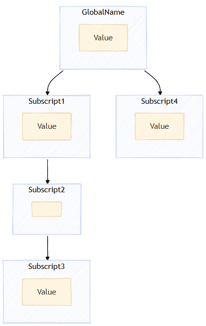
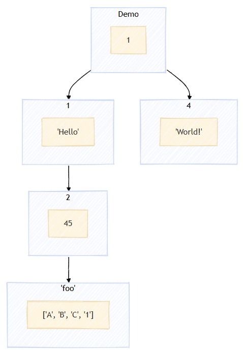
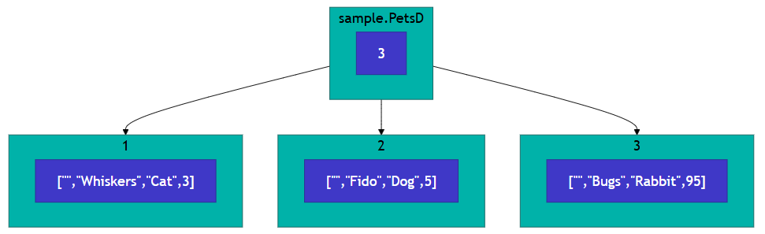
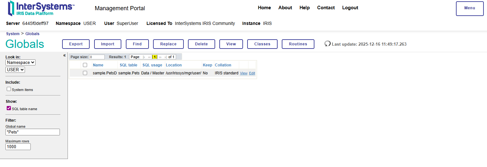
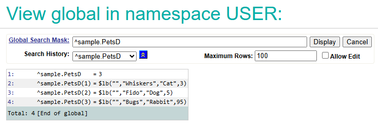

# Data Models in InterSystems IRIS

## Globals

InterSystems IRIS uses a data model of heirarchical, schema-less, multidimensional arrays, called globals. Globals are inherently flexible and can be projected or represented as many other data models, meaning the same same data can be seen as relational tables, objects, key-value pairs or documents. They are named globals because they can be accessed from anywhere, similar to describing variables as having global scope in other programming contexts.

Globals can be visualised as a tree diagram, where each node of the tree has a key, or subscript and may have value.



Globals are described as sparse, because nodes exist without a value if a sub-node exists. For example, in the diagram above, the Subscript2 node does not have a value, and only exists because the node at Subscript 3 is defined as `^GlobalName("Subscript1", "Subscript2", "Subscript3) = Value`. An empty node, like that at Subscript2 does not cost any resources.

### Datatypes

Both the keys and values within global structures can be of multiple different types, global can be used as a standard numbered array, by setting nodes as sequential integer numbers. Values can also be lists. 

Reading and writing to globals has been optimised over decades and is incredibly fast.



## Accessing Globals Directly

Globals are refered to by a caret `^` character, which differentiates a variable from a standard variable.

To access a specific node of a global, one simply lists the subscript. The ObjectScript code below shows how the global displayed above could be created. 

```objectscript
// Set the root node
set ^Demo = 1
// Node 1
set ^Demo(1) = "Hello"
// Node 1,2
set ^Demo(1, 2) = 45
// Node 1,2,'foo'
set ^Demo(1, 2, "foo") = $LISTBUILD("A", "B", "C", 1)
// Node 4
set ^Demo(4) = "World!"
```

We can use the same method to access the values:

```objectscript
write ^Demo
// Output: 1

write ^Demo(1, 2, "foo")
// Output: $lb("A","B","C",1)    Note $lb() is short for $ListBuild and refers to a list object
```

To see the entire global object, we can use `zwrite`:

```objectscript
zwrite ^Demo
/* output:
^Demo=1
^Demo(1)="Hello"
^Demo(1,2)=45
^Demo(1,2,"foo")=$lb("A","B","C",1)
^Demo(4)="World!"
*/
```

## Accessing Globals with an Object Model

As the [Class Programming quickstart](./ClassProgramming.md) shows in detail, we can create a globals that are saved to the database with Persistent Classes.

```objectscript
Class sample.Pets Extends %Persistent
{
    // Name of Pet
    Property Name As %String;
    // Type of Animal
    Property Type As %String;
    // Age of Pet
    Property Age As %Integer;
}
```
We can use this to create a new Pet object as follows: 

```objectscript
set newpet = ##class(sample.Pets).%New()
set newpet.Name = "Whiskers"
set newpet.Type = "Cat"
set newpet.Age = 3
do newpet.%Save()
```

A persistent class object will then be saved to a global. This global will, by default, share the name of the class with a 'D' character appended. For the above sample.Pets example, the data should be found in the global `^sample.PetsD`.

```objectscript
zwrite ^sample.PetsD
/*output:
^sample.PetsD=1
^sample.PetsD(1)=$lb("","Whiskers","Cat",3)
*/
```
Here, the root node has the value 1, this shows the number of data points added. The data is stored at global node 1 as a list object, with each of the rows.

To access a specific value, we can use `.%OpenId()`:

```objectscript
set pet = ##class(sample.Pets).%OpenId(1)
zwrite pet
/*output: 
+----------------- general information ---------------
|      oref value: 2
|      class name: sample.Pets
|           %%OID: $lb("1","sample.Pets")
| reference count: 2
+----------------- attribute values ------------------
|       %Concurrency = 1  <Set>
|                Age = 3
|               Name = "Whiskers"
|               Type = "Cat"
+-----------------------------------------------------
*/
```

## Accessing Globals with SQL (Relational model)

Global structures in InterSystems IRIS can also be used as relational databases which can be queried as SQL. To see the data we created above, we can use:

```sql
Select ID, Name, Type, Age FROM sample.Pets
```

which would output the following table:

|ID|Name|Type|Age|
|--|----|----|---|
| 1|Whiskers|Cat|3|

We could also insert new values into the table with SQL (these commands need to be run one at a time).

```sql
INSERT INTO sample.Pets (Name, Type, Age) VALUES ('Fido', 'Dog', 5)

INSERT INTO sample.Pets (Name, Type, Age) VALUES ('Bugs', 'Rabbit', 95)
``` 

Again, this is added to the `^sample.PetsD` global, so we can see these values with:

```objectscript
zwrite ^sample.PetsD
/* output:
^sample.PetsD=3
^sample.PetsD(1)=$lb("","Whiskers","Cat",3)
^sample.PetsD(2)=$lb("","Fido","Dog",5)
^sample.PetsD(3)=$lb("","Bugs","Rabbit",95)
*/
```

We can therefore visualise the following table:

|ID|Name|Type|Age|
|--|----|----|---|
| 1|Whiskers|Cat|3|
| 2|Fido|Dog|5|
| 3|Bugs|Rabbit|95|

as the global shown here:




## Using the globals explorer page

We can see globals using the Globals Explorer page of the Management portal at http://localhost:52773/csp/sys/exp/%25CSP.UI.Portal.GlobalList.zen?$NAMESPACE=USER (note, you may need to change server or port for this URL). We can filter the globals by name, using `*` as a wildcard, to find globals:



Clicking on `View` will display the data stored in the global:



For a detailed explanation of globals, see: [Video: What Are Globals? | Youtube](https://www.youtube.com/watch?v=jJifoZq2bW0)

